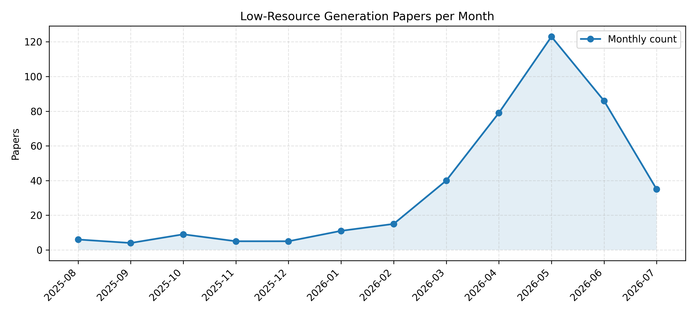

[![Contributors][contributors-shield]][contributors-url]
[![Forks][forks-shield]][forks-url]
[![Stargazers][stars-shield]][stars-url]
[![Issues][issues-shield]][issues-url]

# Low-Resource Generation Arxiv Daily Paper

This repository tracks low-resource generation related papers from arXiv.

## Updated on 2026.07.21

## Summary

- Total papers in JSON: **418**
- Recent 30 days: **60**
- Older than 30 days: **358**
- README display limit: **200** papers; extra papers stay in `docs/arxiv-daily.json`.

## Recent 30 Days

|Date|Title|Categories|PDF|Code|
|---|---|---|---|---|
|**2026-07-20**|**Exploratory and Assimilating Reflection: Reflective Recall Cycle for Long-term Memory**|cs.AI|[2607.17879v1](http://arxiv.org/abs/2607.17879v1)|null|
|**2026-07-20**|**Retrieval-Augmented Interpretable Learning: Towards Task-Specific Zero-Shot Models in Healthcare**|cs.LG, cs.AI|[2607.17508v1](http://arxiv.org/abs/2607.17508v1)|null|
|**2026-07-19**|**KyrgyzLLM-Bench: Benchmarking Kyrgyz Language Understanding**|cs.CL|[2607.17173v1](http://arxiv.org/abs/2607.17173v1)|null|
|**2026-07-19**|**Robust Assamese Speech Recognition through Controlled Fine-Tuning of Whisper Models**|cs.LG|[2607.17164v1](http://arxiv.org/abs/2607.17164v1)|null|
|**2026-07-18**|**NOWJ@COLIEE 2026: Adaptive Pipelines for Legal Retrieval and Reasoning**|cs.CL|[2607.16603v1](http://arxiv.org/abs/2607.16603v1)|null|
|**2026-07-17**|**RIMS: Preference Optimization via Smoothed Multi-pair Aggregation for Small-Scale LLM Retrieval-Augmented Generation**|cs.CL|[2607.16431v1](http://arxiv.org/abs/2607.16431v1)|**[code](https://github.com/tptrix29/RIMS)**|
|**2026-07-16**|**One-Shot Generative Design for Disordered Metamaterials via Self-Organizing Neural Cellular Automata**|cs.CE, cs.LG|[2607.14475v1](http://arxiv.org/abs/2607.14475v1)|null|
|**2026-07-15**|**A POS Tier Is the Key to Automated Annotation for Low-Resource Language Documentation: Neural Interlinear Glossing for Irabu, a Southern Ryukyuan Language**|cs.CL|[2607.13372v1](http://arxiv.org/abs/2607.13372v1)|null|
|**2026-07-14**|**The Geometry of Memorization: Finite-Time Spectral Sensitivity as a Diagnostic for Flow Matching Models**|cs.LG|[2607.12616v1](http://arxiv.org/abs/2607.12616v1)|null|
|**2026-07-14**|**Translation as a Computationally Efficient Bridge: Feasibility of English BERT for Low-Resource Languages**|cs.CL|[2607.12612v1](http://arxiv.org/abs/2607.12612v1)|null|
|**2026-07-14**|**Sample Efficient Generative Optimization for Molecular Design**|cs.LG|[2607.12488v1](http://arxiv.org/abs/2607.12488v1)|null|
|**2026-07-14**|**SinAE: A Single-Architecture Flow-Matching Autoencoder for Cross-Domain Atomic Systems**|cs.LG|[2607.12380v1](http://arxiv.org/abs/2607.12380v1)|**[code](https://github.com/BlueWhaleLab/SinAE)**|
|**2026-07-13**|**Direct Image-to-Modern Vietnamese Translation of Han-Nom Manuscripts via Multimodal RLHF Preference Alignment**|cs.CL, cs.CV|[2607.11434v1](http://arxiv.org/abs/2607.11434v1)|null|
|**2026-07-12**|**Diachronic Sample Integration: Robust Tail-Risk Estimation with Generative Models**|cs.LG, cs.AI, q-fin.RM|[2607.10810v1](http://arxiv.org/abs/2607.10810v1)|null|
|**2026-07-11**|**Minionese: Comprehensive Benchmark and Mechanistic Study of Multilingual LLM Safety**|cs.CR, cs.AI|[2607.10112v1](http://arxiv.org/abs/2607.10112v1)|**[code](https://github.com/Brentkong/Minionese-Comprehensive-Benchmark-and-Mechanistic-Study-of-Multilingual-LLM-Safety.git)**|
|**2026-07-10**|**Index SLM Technical Report**|cs.CL|[2607.09885v1](http://arxiv.org/abs/2607.09885v1)|**[code](https://github.com/bilibili/Index-1.9B)**|
|**2026-07-10**|**Quantum-Enhanced Synthetic Data Generation Using Quantum Circuit Born Machines for Imbalanced Tabular Learning**|quant-ph, cs.LG|[2607.09113v1](http://arxiv.org/abs/2607.09113v1)|null|
|**2026-07-09**|**MASTE: A Multi-Agent Pipeline for Zero-Shot Aspect Sentiment Triplet Extraction**|cs.CL|[2607.08080v1](http://arxiv.org/abs/2607.08080v1)|**[code](https://github.com/Hankerlove/MASTE)**|
|**2026-07-08**|**Feedback Manipulation Regularization: Enabling Offline Agent Alignment for Imitation Learning**|cs.AI, cs.HC, cs.LG|[2607.07859v1](http://arxiv.org/abs/2607.07859v1)|null|
|**2026-07-08**|**Selective Left-Shift: Turning Test-Time Compute and Difficulty-based Curation into Training Data for Low-Resource Code Generation**|cs.LG|[2607.07748v1](http://arxiv.org/abs/2607.07748v1)|null|
|**2026-07-08**|**Future Confidence Distillation in Large Language Models**|cs.CL, cs.AI|[2607.07626v1](http://arxiv.org/abs/2607.07626v1)|null|
|**2026-07-07**|**Estimating Uncertainty from Reasoning: A Large-Scale Study of Multi- and Crosslingual MCQA Performance in LLMs**|cs.CL, cs.AI|[2607.06327v2](http://arxiv.org/abs/2607.06327v2)|null|
|**2026-07-07**|**Property-Driven Synthetic Data Engineering for Data-Scarce Software Systems: Reflections from the Breast Cancer Domain**|cs.SE, cs.AI|[2607.06133v1](http://arxiv.org/abs/2607.06133v1)|null|
|**2026-07-07**|**PluraMath: Extending Mathematical Reasoning Evaluation Beyond High-Resource Languages**|cs.CL, cs.AI|[2607.05992v1](http://arxiv.org/abs/2607.05992v1)|null|
|**2026-07-07**|**CoPiT: Cognitive Pivot Translation for Digraphic Low-Resource Mongolian in the Traditional Script**|cs.CL|[2607.05849v1](http://arxiv.org/abs/2607.05849v1)|**[code](https://anonymous.4open.science/r/anonymous_project-76C7)**|
|**2026-07-06**|**Formal Disco: Scalable Open-Ended Generation of Formally Verified Programs**|cs.AI|[2607.04631v1](http://arxiv.org/abs/2607.04631v1)|null|
|**2026-07-06**|**LLM-Driven CI-CD Workflow Intelligence for Cyber Systems Engineering**|cs.SE, cs.AI|[2607.04579v1](http://arxiv.org/abs/2607.04579v1)|null|
|**2026-07-05**|**CertMix: Certified, Data-Efficient Metamaterial Design by Affine Mixing of Aligned Neural-Implicit Weight Spaces**|cs.LG|[2607.04123v1](http://arxiv.org/abs/2607.04123v1)|null|
|**2026-07-04**|**When Simpler Is Better: Evaluating Translation Pipelines for Medieval Latin Manuscripts**|cs.CV, cs.AI, cs.CL|[2607.03836v1](http://arxiv.org/abs/2607.03836v1)|null|
|**2026-07-04**|**Punching Above Their Weight: Classification-Head Fine-Tuning of Tiny Language Models (TLMs) for Verifiable Multiple-Choice Tasks**|cs.LG, cs.AI, cs.CL|[2607.03801v1](http://arxiv.org/abs/2607.03801v1)|null|
|**2026-07-03**|**Conditional Diffusion Guided Knowledge Transfer for Multi-Domain Knowledge Graph Completion**|cs.CL, cs.AI|[2607.03154v1](http://arxiv.org/abs/2607.03154v1)|null|
|**2026-07-03**|**Labeled-Data-Free Meta-Learning: Efficient Task Generation Using Pre-trained Models and Unlabeled Data**|cs.LG|[2607.02850v1](http://arxiv.org/abs/2607.02850v1)|null|
|**2026-07-02**|**Reinforcement Learning for Data-Efficient Code-Switched ASR**|cs.CL, cs.SD|[2607.02757v1](http://arxiv.org/abs/2607.02757v1)|null|
|**2026-07-02**|**Challenges and Recommendations for LLMs-as-a-Judge in Multilingual Settings and Low-Resource Languages**|cs.CL, cs.AI|[2607.02235v1](http://arxiv.org/abs/2607.02235v1)|null|
|**2026-07-01**|**Sequentially-Controlled Interactive Multi-Particle Flow-Maps for Online Feedback-Driven Search**|cs.LG, cs.AI, cs.CE|[2607.01144v1](http://arxiv.org/abs/2607.01144v1)|null|
|**2026-06-30**|**ALEE: Any-Language Evaluation of Embeddings via English-Centric Minimal Pairs**|cs.CL|[2607.00171v1](http://arxiv.org/abs/2607.00171v1)|**[code](https://github.com/Andrian0s/any-lang-embed-eval)**|
|**2026-06-30**|**Cross-lingual Relation Extraction with Large Language Models: Zero-Shot, Few-Shot, and Fine-Tuned Evaluation on Romanian**|cs.CL, cs.AI|[2606.31718v1](http://arxiv.org/abs/2606.31718v1)|null|
|**2026-06-30**|**Modality-Driven Search with Holistic Trace Judging for ARC-AGI-2**|cs.AI, cs.CL, cs.LG|[2606.31543v1](http://arxiv.org/abs/2606.31543v1)|null|
|**2026-06-30**|**Agentic-Ideation: Sample Efficient Agentic Trajectories Synthesis for Scientific Ideation Agents**|cs.AI|[2606.31229v1](http://arxiv.org/abs/2606.31229v1)|null|
|**2026-06-30**|**Cross-Domain Feature Expansion for Tabular Medical Data via Knowledge Graphs Injection**|cs.AI, cs.ET|[2606.31171v1](http://arxiv.org/abs/2606.31171v1)|null|
|**2026-06-30**|**Can Tabular In-Context Learners Generalize to Biomolecular Property Prediction?**|cs.LG, q-bio.QM, stat.ML|[2606.31126v2](http://arxiv.org/abs/2606.31126v2)|null|
|**2026-06-29**|**Bridging Scientific Heritage: An Arabic--Russian Parallel Corpus and LLM Benchmark for Sustainable Knowledge Transfer**|cs.CL|[2606.30943v1](http://arxiv.org/abs/2606.30943v1)|null|
|**2026-06-29**|**Translating Natural Language to Strategic Temporal Specifications via LLMs**|cs.MA, cs.AI|[2606.30441v2](http://arxiv.org/abs/2606.30441v2)|null|
|**2026-06-29**|**ARMOR: Adaptive Retriever Optimization for Low-Resource Telecom Question Answering**|cs.IR, cs.AI, cs.CL, cs.LG|[2606.29706v1](http://arxiv.org/abs/2606.29706v1)|**[code](https://github.com/heshandevaka/ARMOR.git)**|
|**2026-06-28**|**KrishokChat: A Citation-Grounded Dataset and Benchmark for Bengali Agricultural Advisory**|cs.LG|[2606.29243v1](http://arxiv.org/abs/2606.29243v1)|null|
|**2026-06-26**|**Beyond Sparse Supervision: Diffusion-Guided Learning for Few-Shot Graph Fraud Detection**|cs.LG, cs.AI|[2606.28134v1](http://arxiv.org/abs/2606.28134v1)|null|
|**2026-06-26**|**SHARD: cell-keyed residual splitting for alignment-resistant private dense retrieval**|cs.CR, cs.AI, cs.IR|[2606.27976v1](http://arxiv.org/abs/2606.27976v1)|null|
|**2026-06-25**|**Causal Connections: Leveraging Multilingual Fine-Tuning for Financial QA@FinCausal 2026**|cs.CL|[2606.27446v1](http://arxiv.org/abs/2606.27446v1)|null|
|**2026-06-25**|**Multilingual Reasoning Cascades Need More Context**|cs.CL|[2606.27306v1](http://arxiv.org/abs/2606.27306v1)|null|
|**2026-06-25**|**Kalman Prototypical Networks for Few-shot Fault Detection in Combined Cycle Gas Turbines**|cs.AI|[2606.26710v1](http://arxiv.org/abs/2606.26710v1)|null|
|**2026-06-25**|**Comparing BERT Sentence-Pair Classification and Few-Shot LLM Prompting for Detecting Threat and Solution Framing in German Climate News**|cs.CL|[2606.26489v1](http://arxiv.org/abs/2606.26489v1)|null|
|**2026-06-25**|**Soft Token Alignment for Cross-Lingual Reasoning**|cs.CL|[2606.26466v1](http://arxiv.org/abs/2606.26466v1)|null|
|**2026-06-24**|**Dziri Voicebot: An End-to-End Low-Resource Speech-to-Speech Conversational System for Algerian Dialect**|cs.CL|[2606.26003v2](http://arxiv.org/abs/2606.26003v2)|null|
|**2026-06-24**|**Riazi-8B: An Urdu Large Language Model for Mathematical Reasoning**|cs.CL|[2606.25568v1](http://arxiv.org/abs/2606.25568v1)|null|
|**2026-06-24**|**Neural Machine Translation for Low-Resource Tangkhul--English**|cs.CL, cs.AI|[2606.25365v1](http://arxiv.org/abs/2606.25365v1)|null|
|**2026-06-23**|**Text Distance from Nested and Hierarchical Repetitions: A Compression-Based Perspective**|cs.CL, cs.IT|[2607.05416v1](http://arxiv.org/abs/2607.05416v1)|null|
|**2026-06-23**|**Matching Tasks to Objectives: Fine-Tuning and Prompt-Tuning Strategies for Encoder-Decoder Pre-trained Language Models**|cs.AI, cs.CL|[2606.24841v1](http://arxiv.org/abs/2606.24841v1)|**[code](https://github.com/puraminy/MTO/)**|
|**2026-06-23**|**Neural Network-Based Parametric Model Reduction for Predicting Turbulent Flow for Different Vehicle Geometries**|cs.CE, cs.AI|[2606.24265v1](http://arxiv.org/abs/2606.24265v1)|null|
|**2026-06-22**|**GRAIN: Group Aggregation via Min-Norm Objective**|cs.LG, stat.ML|[2606.22917v1](http://arxiv.org/abs/2606.22917v1)|null|
|**2026-06-21**|**Deep Learning-Based Sign Language Recognition from Videos and Cross-Lingual Translation to Indian Vernaculars**|cs.AI, cs.LG|[2606.22494v1](http://arxiv.org/abs/2606.22494v1)|null|

## Older Than 30 Days

|Date|Title|Categories|PDF|Code|
|---|---|---|---|---|
|**2026-06-20**|**Evaluating Large Language Models for Hausa and Fongbe Machine Translation: Benchmarks, Failures, and Metric Reliability**|cs.CL, cs.AI, cs.LG|[2606.22269v1](http://arxiv.org/abs/2606.22269v1)|null|
|**2026-06-20**|**FeLoG: Scalable and Efficient Distributed Graph Embedding with Feedback Loop Mechanism**|cs.DC, cs.LG|[2606.22180v2](http://arxiv.org/abs/2606.22180v2)|null|
|**2026-06-20**|**Patched Flow Matching: Generative Wall-Pressure Reconstruction Beyond Training-Domain Scales from Sparse Sensors**|physics.flu-dyn, cs.LG|[2606.22084v1](http://arxiv.org/abs/2606.22084v1)|null|
|**2026-06-19**|**Error-Aware TF-IDF Retrieval-Augmented Generation for ASR Error Correction**|cs.CL, cs.AI, cs.IR|[2606.24915v1](http://arxiv.org/abs/2606.24915v1)|null|
|**2026-06-19**|**Imitation from Heterogeneous Demonstrations using Grounded Latent-Action World Models**|cs.RO, cs.AI, cs.LG|[2606.21672v1](http://arxiv.org/abs/2606.21672v1)|**[code](https://viccccciv.github.io/glam/)**|
|**2026-06-19**|**Synthetic Audio Generation Framework for Air Traffic Control Speech Recognition**|cs.CL|[2606.21340v1](http://arxiv.org/abs/2606.21340v1)|null|
|**2026-06-19**|**DataClaw0: Agentic Tailoring Multimodal Data from Raw Streams**|cs.LG, cs.AI|[2606.21337v1](http://arxiv.org/abs/2606.21337v1)|**[code](https://czjdsg.github.io/MakeAnyData)**|
|**2026-06-19**|**OmniV2X: A Generative Foundation Planner for Efficient End-to-End Cooperative Driving**|cs.RO, cs.AI|[2606.21165v1](http://arxiv.org/abs/2606.21165v1)|null|
|**2026-06-17**|**DF-ExpEnse: Diffusion Filtered Exploration for Sample Efficient Finetuning**|cs.RO, cs.LG|[2606.19656v1](http://arxiv.org/abs/2606.19656v1)|**[code](https://df-expense.github.io)**|
|**2026-06-17**|**G-IdiomAlign: A Gloss-Pivoted Benchmark for Cross-Lingual Idiom Alignment**|cs.CL, cs.AI|[2606.18989v1](http://arxiv.org/abs/2606.18989v1)|null|
|**2026-06-16**|**Want Better Synthetic Data? Steer It: Activation Steering for Low-Resource Language Generation**|cs.CL|[2606.18389v1](http://arxiv.org/abs/2606.18389v1)|null|
|**2026-06-16**|**When English Isn't the Best Teacher: Source Language Effects in Cross-Lingual In-Context Learning**|cs.CL, cs.AI|[2606.18033v1](http://arxiv.org/abs/2606.18033v1)|null|
|**2026-06-15**|**MindAlign: Decoding Inner Speech from fMRI Signals via Multimodal Embedding Alignment under Limited Data**|cs.CL, cs.AI, eess.AS|[2606.20696v1](http://arxiv.org/abs/2606.20696v1)|null|
|**2026-06-15**|**Diffusion Offline Reinforcement Learning for Fair and Energy-Efficient UAV-Assisted Wireless Networks**|cs.LG|[2606.16331v1](http://arxiv.org/abs/2606.16331v1)|null|
|**2026-06-14**|**CIWI-CKT: Chaos-Informed Wave Interference Feature Fusion and Cross-City Knowledge Transfer for Traffic Flow Forecasting**|cs.LG, cs.AI|[2606.15642v1](http://arxiv.org/abs/2606.15642v1)|null|
|**2026-06-14**|**HAPI-EP: Towards Hybrid, Adaptive, and Predictive Digital Twins of Cardiac Electrophysiology**|cs.LG|[2606.15637v1](http://arxiv.org/abs/2606.15637v1)|null|
|**2026-06-13**|**PHINN: Persistent Homology Inspired Neural Network for Rare-Event Time Series Generation**|cs.LG, math.AT, q-fin.RM, stat.ML|[2606.15452v1](http://arxiv.org/abs/2606.15452v1)|null|
|**2026-06-13**|**Few-Shot Biomedical Relation Extraction with Large Language Models: A Viable Alternative to Supervised Learning?**|cs.CL, cs.AI|[2606.15412v1](http://arxiv.org/abs/2606.15412v1)|null|
|**2026-06-13**|**Towards a Unified Generative Model for Scarce Time Series with Domain Experts**|cs.LG|[2606.15172v1](http://arxiv.org/abs/2606.15172v1)|null|
|**2026-06-12**|**Combining Retrieval-Augmented Text Generation with LLMs for Reading Content Recommendations**|cs.IR, cs.AI|[2606.14817v1](http://arxiv.org/abs/2606.14817v1)|null|
|**2026-06-11**|**SkMTEB: Slovak Massive Text Embedding Benchmark and Model Adaptation**|cs.CL, cs.AI, cs.LG|[2606.13647v1](http://arxiv.org/abs/2606.13647v1)|null|
|**2026-06-11**|**Pipette: An Embodied Simulation Platform, Benchmark, and Data-Efficient Augmentation Framework for Wet-Lab Robotics**|cs.RO, cs.AI|[2606.12936v2](http://arxiv.org/abs/2606.12936v2)|null|
|**2026-06-10**|**Surveying GenAI-based Automation in Printed Circuit Board Design and Test**|cs.AR, cs.AI|[2606.17074v1](http://arxiv.org/abs/2606.17074v1)|null|
|**2026-06-10**|**Lius: Translation Model Based Instructional Lingustic Using Continual Instruction Tuning In Kupang Malay**|cs.CL|[2606.11786v1](http://arxiv.org/abs/2606.11786v1)|null|
|**2026-06-09**|**Schützen: Evaluating LLM Safety in Bulgarian and German Contexts**|cs.CL|[2606.11316v1](http://arxiv.org/abs/2606.11316v1)|**[code](https://github.com/xnlp-lab/Schutzen)**|
|**2026-06-09**|**Small Data, Big Noise: Adversarial Training for Robust Parameter-Efficient Fine-Tuning**|cs.CL|[2606.10610v1](http://arxiv.org/abs/2606.10610v1)|null|
|**2026-06-08**|**Data Synthesis and Parameter-Efficient Fine-Tuning for Low-Resource NMT: A Case Study on Q'eqchi' Mayan**|cs.CL, cs.AI, cs.LG|[2606.09767v1](http://arxiv.org/abs/2606.09767v1)|null|
|**2026-06-08**|**Transition-Based Digital Twin Modelling for Alzheimer's Disease under Sparse Longitudinal Data**|cs.LG, cs.AI|[2606.09671v1](http://arxiv.org/abs/2606.09671v1)|null|
|**2026-06-08**|**Automated IEP Generation from Traditional Chinese Parent-Teacher Interviews via Corpus-Grounded Feature Diffusion**|cs.CL|[2606.09603v1](http://arxiv.org/abs/2606.09603v1)|null|
|**2026-06-08**|**OpenBibleTTS: Large-Scale Speech Resources and TTS Models for Low-Resource Languages**|cs.CL, cs.SD|[2606.09553v1](http://arxiv.org/abs/2606.09553v1)|null|
|**2026-06-08**|**Targeting World Models to Compromise Robot Learning Pipelines**|cs.RO, cs.AI, cs.CR|[2606.09499v1](http://arxiv.org/abs/2606.09499v1)|null|
|**2026-06-08**|**NüshuVoice: Reviving the Voice of Endangered Nüshu with Pitch-Aware Text-to-Speech**|cs.CL|[2606.09295v1](http://arxiv.org/abs/2606.09295v1)|**[code](https://anonymous.4open.science/r/Nvshu-TTS-2EB6)**|
|**2026-06-08**|**LATTEArena: An Evaluation Framework for LLM-powered Tabular Feature Engineering (Extended Version)**|cs.AI|[2606.09004v1](http://arxiv.org/abs/2606.09004v1)|null|
|**2026-06-07**|**PIPE-Cypher: Automatic Enterprise Benchmark Generation for Text-to-Cypher Systems**|cs.LG, cs.AI, cs.DB, cs.SE|[2606.08481v1](http://arxiv.org/abs/2606.08481v1)|null|
|**2026-06-06**|**ZAS-SQL: Distilling Rules from Failures for Zero-Shot Text-to-SQL**|cs.CL|[2606.08245v1](http://arxiv.org/abs/2606.08245v1)|null|
|**2026-06-06**|**De novo molecular generation with optical property preconditioning at the token level**|cs.LG|[2606.08221v1](http://arxiv.org/abs/2606.08221v1)|null|
|**2026-06-05**|**The ACUTE Protocol: Operationalizing Language Model Activations for Better Calibration, Utility, and Trust**|cs.CL, cs.AI, cs.LG|[2606.07822v2](http://arxiv.org/abs/2606.07822v2)|null|
|**2026-06-05**|**Automatic Extraction of Structured Information from Brain MRI Reports Using an Open-Weight Large Language Model**|cs.AI|[2606.07721v1](http://arxiv.org/abs/2606.07721v1)|null|
|**2026-06-05**|**CoMetaPNS: Continually Meta-learning Personalized Neural Surrogates for Cardiac Electrophysiology Simulations**|cs.LG|[2606.07488v1](http://arxiv.org/abs/2606.07488v1)|null|
|**2026-06-05**|**Making the Most of Limited Data: Score-Aware Training for Text-to-Music Generation**|cs.LG|[2606.07387v1](http://arxiv.org/abs/2606.07387v1)|null|
|**2026-06-05**|**UrduMMLU: A Massive Multitask Benchmark for Urdu Language Understanding**|cs.CL, cs.AI|[2606.07167v1](http://arxiv.org/abs/2606.07167v1)|null|
|**2026-06-04**|**Synthics: Synthetic Physics-like Datasets for Machine Learning**|cs.LG|[2606.06724v1](http://arxiv.org/abs/2606.06724v1)|null|
|**2026-06-04**|**Reinforcement Learning Elicits Contextual Learning of Unseen Language Translation**|cs.CL|[2606.06428v1](http://arxiv.org/abs/2606.06428v1)|null|
|**2026-06-04**|**A Komi-Yazva--Russian Parallel Corpus and Evaluation Protocol for Zero- and Few-Shot LLM Translation**|cs.CL|[2606.06420v1](http://arxiv.org/abs/2606.06420v1)|null|
|**2026-06-04**|**English-to-Prakrit Machine Translation via Multilingual Transfer Learning**|cs.CL|[2606.06038v1](http://arxiv.org/abs/2606.06038v1)|**[code](https://github.com/D3v1s0m/indictrans2-prakrit-mt)**|
|**2026-06-04**|**Can LLMs Write Correct TLA+ Specifications? Evaluating Natural-Language-to-TLA+ Generation**|cs.AI, cs.LG, cs.LO, cs.SE|[2606.05792v1](http://arxiv.org/abs/2606.05792v1)|null|
|**2026-06-03**|**Multilingual Coreference Resolution via Cycle-Consistent Machine Translation**|cs.CL, cs.AI, cs.LG|[2606.05444v1](http://arxiv.org/abs/2606.05444v1)|null|
|**2026-06-03**|**REGEN: Reference-Guided Synthetic Multivariate Time Series Generation for Forecasting**|cs.LG|[2606.05264v1](http://arxiv.org/abs/2606.05264v1)|null|
|**2026-06-03**|**Caliper: Probing Lexical Anchors versus Causal Structure in LLMs**|cs.CL, cs.IR|[2606.04915v1](http://arxiv.org/abs/2606.04915v1)|null|
|**2026-06-03**|**SANE Schema-aware Natural-language Evaluation of Biological Data**|cs.CL|[2606.04500v1](http://arxiv.org/abs/2606.04500v1)|null|
|**2026-06-03**|**Deliberate Evolution: Agentic Reasoning for Sample-Efficient Symbolic Regression with LLMs**|cs.CL, cs.LG|[2606.04360v1](http://arxiv.org/abs/2606.04360v1)|null|
|**2026-06-02**|**scTranslation: A Comprehensive Benchmark for Single-Cell Multi-Omics Modality Translation**|cs.AI|[2606.03906v1](http://arxiv.org/abs/2606.03906v1)|**[code](https://github.com/Bunnybeibei/scTranslation)**|
|**2026-06-02**|**Reasoning over Grammar: Can Synthetic Linguistic Reasoning Traces Enhance Low-Resource Machine Translation?**|cs.CL|[2606.03782v1](http://arxiv.org/abs/2606.03782v1)|null|
|**2026-06-02**|**Automating Information Extraction and Retrieval for Industrial Spare Parts Pooling**|cs.IR|[2606.03367v2](http://arxiv.org/abs/2606.03367v2)|null|
|**2026-06-02**|**From Script to Semantics: Prompting Strategies for African NLI**|cs.CL, cs.LG|[2606.03304v1](http://arxiv.org/abs/2606.03304v1)|null|
|**2026-06-02**|**Beyond "To whom it may concern": Tailoring Machine Translation to Audience and Intent**|cs.CL|[2606.03259v1](http://arxiv.org/abs/2606.03259v1)|null|
|**2026-06-02**|**EURO-5K: When Does Domain Pretraining Matter? Benchmarking Transformers for EU Reporting Obligation Extraction**|cs.CL|[2606.02971v1](http://arxiv.org/abs/2606.02971v1)|null|
|**2026-06-01**|**Learning When to Translate for Multilingual Reasoning**|cs.CL, cs.AI|[2606.02465v1](http://arxiv.org/abs/2606.02465v1)|**[code](https://github.com/deokhk/LUAR)**|
|**2026-06-01**|**K-BrowseComp: A Web Browsing Agent Benchmark Grounded in Korean Contexts**|cs.CL|[2606.02404v1](http://arxiv.org/abs/2606.02404v1)|null|
|**2026-06-01**|**Coherent Off-Policy Improvement of Large Behavior Models with Learned Rewards**|cs.LG|[2606.02194v1](http://arxiv.org/abs/2606.02194v1)|null|
|**2026-06-01**|**When Meaning Travels: A Granular Lens on Hybrid-MoE's Role in Idiomatic Understanding for Language Models**|cs.CL|[2606.01671v1](http://arxiv.org/abs/2606.01671v1)|null|
|**2026-05-31**|**Time Series as Language: A Universal Tokenizer for General-Purpose Time Series Foundation Models**|cs.LG, cs.AI|[2606.09861v1](http://arxiv.org/abs/2606.09861v1)|null|
|**2026-05-31**|**TukaBench: A Culturally Grounded Jailbreak Benchmark for African Languages**|cs.CL, cs.AI|[2606.01322v1](http://arxiv.org/abs/2606.01322v1)|null|
|**2026-05-31**|**Fine-Tuning Diffusion Models for Molecular Generation via Reinforcement Learning and Fast Sampling**|cs.LG, cs.AI|[2606.01220v1](http://arxiv.org/abs/2606.01220v1)|null|
|**2026-05-31**|**ExpWeaver: LLM Agents Learn from Experience via Latent RAG**|cs.CL|[2606.01041v1](http://arxiv.org/abs/2606.01041v1)|**[code](https://github.com/ulab-uiuc/ExpWeaver)**|
|**2026-05-31**|**PolySpeech-100: A Large-Scale Benchmark for Speech Understanding Across 100+ Languages and Dialects**|cs.CL, cs.AI, eess.AS|[2606.01016v1](http://arxiv.org/abs/2606.01016v1)|**[code](https://github.com/YoungSeng/PolySpeech-100)**|
|**2026-05-30**|**Manifold Diffusion for Structure Generation of Transition Metal Complexes**|cond-mat.mtrl-sci, cs.LG, physics.chem-ph|[2606.00666v1](http://arxiv.org/abs/2606.00666v1)|null|
|**2026-05-29**|**Few-Shot Resampling for Scalable Statistically-Sound Data Mining**|cs.LG, cs.DB, stat.ME|[2606.11235v1](http://arxiv.org/abs/2606.11235v1)|null|
|**2026-05-29**|**Sample-Efficient Post-Training for LEGO Spatial-Physics Reasoning**|cs.LG, cs.AI|[2606.07602v1](http://arxiv.org/abs/2606.07602v1)|null|
|**2026-05-29**|**HOIST: Humanoid Optimization with Imitation and Sample-efficient Tuning for Manipulating Suspended Loads**|cs.RO, cs.LG|[2606.00252v1](http://arxiv.org/abs/2606.00252v1)|null|
|**2026-05-29**|**Beyond Augmentation: Score-Guided Pathological Prior for EEG-based Depression Detection**|cs.LG, cs.AI|[2606.00180v1](http://arxiv.org/abs/2606.00180v1)|null|
|**2026-05-29**|**BenHalluEval: A Multi-Task Hallucination Evaluation Framework for Large Language Models on Bengali**|cs.CL, cs.AI|[2605.31483v2](http://arxiv.org/abs/2605.31483v2)|**[code](https://anonymous.4open.science/r/BanglaHalluEval-EB77)**|
|**2026-05-29**|**"Înţelegi Româneşte?'' A Recipe for Romanian Vision-Language Models**|cs.CL|[2605.31401v2](http://arxiv.org/abs/2605.31401v2)|null|
|**2026-05-29**|**Developing a Culturally Grounded, AI-Augmented UX Research Point of View (POV): An Exemplar Case Study from Telemedicine Dementia Care**|cs.HC, cs.AI|[2605.31147v1](http://arxiv.org/abs/2605.31147v1)|null|
|**2026-05-29**|**GraphARC: A Comprehensive Benchmark for Graph-Based Abstract Reasoning**|cs.AI|[2605.31031v1](http://arxiv.org/abs/2605.31031v1)|null|
|**2026-05-29**|**Generating Reports or Repeating Templates? Measuring and Mitigating Template Collapse in 3D CT Report Generation**|cs.CV, cs.AI, cs.CL|[2605.30984v1](http://arxiv.org/abs/2605.30984v1)|null|
|**2026-05-28**|**Destruction is a General Strategy to Learn Generation; Diffusion's Strength is to Take it Seriously; Exploration is the Future**|cs.LG, cs.IT|[2605.30553v1](http://arxiv.org/abs/2605.30553v1)|null|
|**2026-05-28**|**Sample-Efficient Diffusion-based Reinforcement Learning with Critic Guidance**|cs.RO, cs.LG|[2605.30056v1](http://arxiv.org/abs/2605.30056v1)|**[code](https://dingsht.tech/cgpo-webpage)**|
|**2026-05-28**|**MEMENTO: Leveraging Web as a Learning Signal for Low-Data Domains**|cs.AI|[2605.29795v1](http://arxiv.org/abs/2605.29795v1)|null|
|**2026-05-28**|**AfriScience-MT: Towards Decolonizing Science in Africa through Text Translation**|cs.CL|[2605.29741v1](http://arxiv.org/abs/2605.29741v1)|null|
|**2026-05-28**|**Think Fast, Talk Smart: Partitioning Deterministic and Neural Computation for Structured Health Text Generation**|cs.AI|[2605.29652v1](http://arxiv.org/abs/2605.29652v1)|null|
|**2026-05-28**|**Source-Grounded Semantic Reinforcement Learning for Low-Resource Target-Language Generation**|cs.CL, cs.AI|[2605.29502v1](http://arxiv.org/abs/2605.29502v1)|null|
|**2026-05-27**|**Enhancing BiGRU with a KAN Block for Legal Document Classification and Summarization**|cs.CL, cs.AI, cs.LG|[2606.00116v1](http://arxiv.org/abs/2606.00116v1)|null|
|**2026-05-27**|**Towards Reliable Multilingual LLMs-as-a-Judge: An Empirical Study**|cs.CL, cs.AI|[2605.28710v1](http://arxiv.org/abs/2605.28710v1)|null|
|**2026-05-27**|**Activation Steering for Synthetic Data Generation: The Role of Diversity in Downstream Safety Detection**|cs.LG, cs.CL|[2605.28664v1](http://arxiv.org/abs/2605.28664v1)|null|
|**2026-05-27**|**PrionNER: A Named Entity Recognition Dataset for Prion Disease Biomedical Literature**|cs.CL|[2605.28375v1](http://arxiv.org/abs/2605.28375v1)|**[code](https://github.com/daotuanan/PrionNER/)**|
|**2026-05-27**|**PubMedCausal: A Span-Level Annotated Corpus for Causal Relation Extraction in Biomedical Text**|cs.CL|[2605.28363v1](http://arxiv.org/abs/2605.28363v1)|**[code](https://github.com/josiahpaul07/PubMedCausal_Exp)**|
|**2026-05-27**|**Explaining is Harder Than Predicting Alone: Evaluating Concept-based Explanations of MLLMs as ICL Visual Classifiers**|cs.AI, cs.CL, cs.LG, cs.LO, cs.MA|[2605.28215v1](http://arxiv.org/abs/2605.28215v1)|null|
|**2026-05-27**|**Hierarchical Synthetic Tabular Data Generation: A Hybrid Top-Down and Bottom-Up Framework**|cs.LG|[2605.28198v2](http://arxiv.org/abs/2605.28198v2)|null|
|**2026-05-27**|**The Fragility of Chain-of-Thought Monitoring Across Typologically Diverse Languages**|cs.CL, cs.AI|[2605.27901v1](http://arxiv.org/abs/2605.27901v1)|**[code](https://multilingual-cot-monitoring.github.io/)**|
|**2026-05-26**|**TriHead-GAN: A Generative Adversarial Network with Triple-Head Discriminator for Carbon Emission Time Series Generation**|cs.LG|[2606.07569v1](http://arxiv.org/abs/2606.07569v1)|null|
|**2026-05-26**|**Reading or Guessing? Visual Grounding Failures of Vision-Language Models for OCR in Ancient Greek Editions**|cs.CL, cs.AI, cs.CV, cs.DL|[2605.27750v1](http://arxiv.org/abs/2605.27750v1)|null|
|**2026-05-26**|**Learning to Translate from Soft to Hard LLM Prompts**|cs.CL, cs.LG|[2605.27642v1](http://arxiv.org/abs/2605.27642v1)|null|
|**2026-05-26**|**High-Quality Synthetic Financial Time-Series using a GAN-Diffusion Framework**|cs.LG, cs.AI|[2605.27113v1](http://arxiv.org/abs/2605.27113v1)|null|
|**2026-05-26**|**BhashaSetu: A Data-Centric Approach to Low-Resource Machine Translation**|cs.CL, cs.LG|[2605.27050v1](http://arxiv.org/abs/2605.27050v1)|null|
|**2026-05-26**|**AlbanianLLMSafety: A Safety Evaluation Dataset for Large Language Models in Albanian**|cs.CL|[2605.26954v1](http://arxiv.org/abs/2605.26954v1)|null|
|**2026-05-26**|**Uncertainty-Aware Budget Allocation for Adaptive Test-Time Reasoning**|cs.CL|[2605.26849v1](http://arxiv.org/abs/2605.26849v1)|**[code](https://github.com/manhitv/UAB)**|
|**2026-05-26**|**Helicase: Uncertainty-Guided Supply Chain Knowledge Graph Construction with Autonomous Multi-Agent LLMs**|cs.AI|[2605.26835v1](http://arxiv.org/abs/2605.26835v1)|null|
|**2026-05-26**|**Generating Logically Consistent Synthetic Supply Chain Data with LLM-Driven Knowledge Graph Reasoning**|cs.CL|[2605.26823v1](http://arxiv.org/abs/2605.26823v1)|null|
|**2026-05-26**|**Self-Improvement Imitation with Biologically Guided Search for Protein Design Under Oracle Budgets**|cs.LG, cs.AI, q-bio.QM|[2605.26690v1](http://arxiv.org/abs/2605.26690v1)|**[code](https://github.com/grimmlab/SILO.git)**|
|**2026-05-25**|**CroCo: Cross-Lingual Contrastive Preference Tuning on Self-Generations**|cs.CL, cs.AI|[2605.26293v1](http://arxiv.org/abs/2605.26293v1)|null|
|**2026-05-25**|**Beyond Summaries: Structure-Aware Labeling of Code Changes with Large Language Models**|cs.SE, cs.AI|[2605.26100v1](http://arxiv.org/abs/2605.26100v1)|null|
|**2026-05-25**|**Forgotten Words: Benchmarking NeoBERT for Dementia Detection in Low-Resource Conversational Filipino and English Speech**|cs.CL|[2605.26007v1](http://arxiv.org/abs/2605.26007v1)|null|
|**2026-05-25**|**Creative Quality Alignment: Expert Tacit Knowledge Transfer via Chain-of-Thought Fine-Tuning**|cs.CL, cs.AI, cs.LG|[2605.25977v1](http://arxiv.org/abs/2605.25977v1)|null|
|**2026-05-25**|**A Controlled Synthetic Benchmark for Educational Aspect-Based Sentiment Analysis**|cs.CL, cs.AI|[2605.25502v1](http://arxiv.org/abs/2605.25502v1)|null|
|**2026-05-25**|**SomaliBench Eval: Measuring English-to-Somali Refusal Gaps in Open-Weight Language Models**|cs.CL, cs.AI, cs.CY|[2605.25420v1](http://arxiv.org/abs/2605.25420v1)|null|
|**2026-05-24**|**From Automation to Collaboration: Human-in-the-Loop Methods for Safe and Trustworthy NLP**|cs.CL|[2605.25226v1](http://arxiv.org/abs/2605.25226v1)|null|
|**2026-05-24**|**Multi-Objective Learning for Diffusion Models: A Statistical Theory under Semi-Supervised Learning**|cs.LG, cs.AI, stat.ML|[2605.25210v1](http://arxiv.org/abs/2605.25210v1)|null|
|**2026-05-22**|**PrismFlow: Residual Dynamics for Flow Matching in Time-Series Generation**|cs.LG, cs.AI|[2605.28867v1](http://arxiv.org/abs/2605.28867v1)|null|
|**2026-05-22**|**When Does Synthetic Patent Data Help? Volume-Fidelity Trade-offs in Low-Resource Multi-Label Classification**|cs.AI, cs.IR|[2605.24296v2](http://arxiv.org/abs/2605.24296v2)|null|
|**2026-05-22**|**Convex Low-resource Accent-Robust Language Detection in Speech Recognition**|cs.LG|[2605.23235v1](http://arxiv.org/abs/2605.23235v1)|**[code](https://pypi.org/project/jaxcld/)**|
|**2026-05-22**|**Self-Improving In-Context Learning**|cs.CL, cs.LG|[2605.23180v1](http://arxiv.org/abs/2605.23180v1)|null|
|**2026-05-21**|**LLM-AutoSciLab: Closed-Loop Scientific Discovery via Active Experimentation with LLMs**|cs.LG, cs.AI|[2605.24043v1](http://arxiv.org/abs/2605.24043v1)|**[code](https://github.com/scientific-discovery/LLM-AutoSciLab)**|
|**2026-05-21**|**DreamerNLplus: Interpretable Modeling of Mental Health Dynamics from Social Media Timelines using Hybrid Rule-Based and RAG Methods**|cs.CL, cs.AI|[2605.23052v1](http://arxiv.org/abs/2605.23052v1)|**[code](https://github.com/4dpicture/CLPsych2026)**|
|**2026-05-21**|**Test-Time Training Undermines Safety Guardrails**|cs.LG, cs.AI|[2605.22984v1](http://arxiv.org/abs/2605.22984v1)|null|
|**2026-05-21**|**Towards a General Intelligence and Interface for Wearable Health Data**|cs.AI|[2605.22759v2](http://arxiv.org/abs/2605.22759v2)|null|
|**2026-05-21**|**Polite on the Surface, Wrong in Practice: A Curated Dataset for Fixing Honorific Failures in Multilingual Bangla Generation**|cs.CL|[2605.22487v1](http://arxiv.org/abs/2605.22487v1)|**[code](https://github.com/ashuvo25/Bangla_Application_LLM/tree/main)**|
|**2026-05-21**|**Evaluation of Chunking Strategies for Effective Text Embedding in Low-Resource Language on Agricultural Documents**|cs.CL|[2605.22203v1](http://arxiv.org/abs/2605.22203v1)|null|
|**2026-05-21**|**A Comparative Study of Language Models for Khmer Retrieval-Augmented Question Answering**|cs.CL|[2605.22099v1](http://arxiv.org/abs/2605.22099v1)|null|
|**2026-05-21**|**Engineering Hybrid Physics-Informed Neural Networks for Next-Generation Electricity Systems: A State-of-the-Art Review**|eess.SY, cs.AI, cs.LG, cs.NE|[2605.21903v1](http://arxiv.org/abs/2605.21903v1)|null|
|**2026-05-20**|**Velocityformer: Broken-Symmetry-Matched Equivariant Graph Transformers for Cosmological Velocity Reconstruction**|astro-ph.CO, cs.LG|[2605.21483v1](http://arxiv.org/abs/2605.21483v1)|null|
|**2026-05-20**|**Learning First Integrals via Backward-Generated Data and Guided Reinforcement Learning**|cs.LG|[2605.21160v1](http://arxiv.org/abs/2605.21160v1)|null|
|**2026-05-20**|**DISC: Decoupling Instruction from State-Conditioned Control via Policy Generation**|cs.RO, cs.AI, cs.LG|[2605.20856v1](http://arxiv.org/abs/2605.20856v1)|**[code](https://github.com/ReNginx/DISC)**|
|**2026-05-20**|**Divide-Prompt-Refine: a Training-Free, Structure-Aware Framework for Biomedical Abstract Generation**|cs.CL|[2605.20628v2](http://arxiv.org/abs/2605.20628v2)|**[code](https://github.com/ScienceNLP-Lab/MultiTagger-v2/tree/main/DPR-BAG)**|
|**2026-05-19**|**Can Large Language Models Reliably Correct Errors in Low-Resource ASR? A Contamination-Aware Case Study on West Frisian**|cs.CL|[2605.19711v1](http://arxiv.org/abs/2605.19711v1)|null|
|**2026-05-18**|**The Annotation Scarcity Paradox in Low-Resource NLP Evaluation: A Decade of Acceleration and Emerging Constraints**|cs.CL|[2605.19066v1](http://arxiv.org/abs/2605.19066v1)|null|
|**2026-05-18**|**Ancient Greek to Modern Greek Machine Translation: A Novel Benchmark and Fine-Tuning Experiments on LLMs and NMT Models**|cs.CL|[2605.18504v1](http://arxiv.org/abs/2605.18504v1)|null|
|**2026-05-18**|**Multilingual jailbreaking of LLMs using low-resource languages**|cs.CL, cs.AI|[2605.18239v1](http://arxiv.org/abs/2605.18239v1)|null|
|**2026-05-16**|**ZeroUnlearn: Few-Shot Knowledge Unlearning in Large Language Models**|cs.LG, cs.AI, cs.CL|[2605.18879v3](http://arxiv.org/abs/2605.18879v3)|**[code](https://github.com/XMUDeepLIT/ZeroUnlearn)**|
|**2026-05-16**|**Why Do Safety Guardrails Degrade Across Languages?**|cs.CL, cs.AI, cs.LG|[2605.17173v1](http://arxiv.org/abs/2605.17173v1)|null|
|**2026-05-16**|**D$^2$Evo: Dual Difficulty-Aware Self-Evolution for Data-Efficient Reinforcement Learning**|cs.LG, cs.AI, cs.CL|[2605.17037v1](http://arxiv.org/abs/2605.17037v1)|null|
|**2026-05-16**|**Retrieval-Based Multi-Label Legal Annotation: Extensible, Data-Efficient and Hallucination-Free**|cs.CL|[2605.16767v1](http://arxiv.org/abs/2605.16767v1)|null|
|**2026-05-15**|**GenAI-FDIA: Physics-Informed Generative Models for False Data Injection Attacks**|cs.CR, cs.AI, cs.LG|[2605.18873v1](http://arxiv.org/abs/2605.18873v1)|null|
|**2026-05-15**|**From Flat Language Labels to Typological Priors: Structured Language Conditioning for Multilingual Speech-to-Speech Translation**|cs.CL, cs.AI|[2605.16026v1](http://arxiv.org/abs/2605.16026v1)|null|
|**2026-05-15**|**ALSO: Adversarial Online Strategy Optimization for Social Agents**|cs.AI, cs.CY|[2605.15768v2](http://arxiv.org/abs/2605.15768v2)|null|
|**2026-05-14**|**Mitigating Data Scarcity in Psychological Defense Classification with Context-Aware Synthetic Augmentation**|cs.CL|[2605.14380v1](http://arxiv.org/abs/2605.14380v1)|**[code](https://github.com/htdgv/CASA-PDC)**|
|**2026-05-14**|**Reinforcement Learning with Semantic Rewards Enables Low-Resource Language Expansion without Alignment Tax**|cs.CL, cs.LG|[2605.14366v1](http://arxiv.org/abs/2605.14366v1)|null|
|**2026-05-13**|**SLAP: Stratified Loss-based Pruning for On-Policy Data-Efficient Instruction Tuning**|cs.CL|[2605.23969v1](http://arxiv.org/abs/2605.23969v1)|null|
|**2026-05-13**|**WARDEN: Endangered Indigenous Language Transcription and Translation with 6 Hours of Training Data**|cs.CL, cs.AI|[2605.13846v1](http://arxiv.org/abs/2605.13846v1)|null|
|**2026-05-13**|**Conformal Anomaly Detection in Python: Moving Beyond Heuristic Thresholds with 'nonconform'**|stat.ML, cs.LG, stat.CO|[2605.13642v1](http://arxiv.org/abs/2605.13642v1)|null|

README omitted **218** older paper(s). See `docs/arxiv-daily.json` for the full archive.

[contributors-shield]: https://img.shields.io/github/contributors/bansky-cl/low-resource-generation-arxiv-daily-paper.svg?style=for-the-badge
[contributors-url]: https://github.com/bansky-cl/low-resource-generation-arxiv-daily-paper/graphs/contributors
[forks-shield]: https://img.shields.io/github/forks/bansky-cl/low-resource-generation-arxiv-daily-paper.svg?style=for-the-badge
[forks-url]: https://github.com/bansky-cl/low-resource-generation-arxiv-daily-paper/network/members
[stars-shield]: https://img.shields.io/github/stars/bansky-cl/low-resource-generation-arxiv-daily-paper.svg?style=for-the-badge
[stars-url]: https://github.com/bansky-cl/low-resource-generation-arxiv-daily-paper/stargazers
[issues-shield]: https://img.shields.io/github/issues/bansky-cl/low-resource-generation-arxiv-daily-paper.svg?style=for-the-badge
[issues-url]: https://github.com/bansky-cl/low-resource-generation-arxiv-daily-paper/issues
