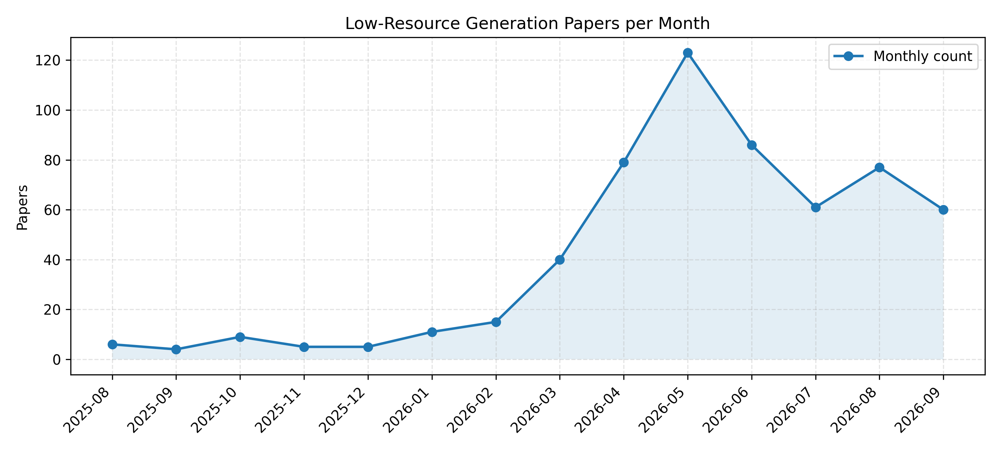

[![Contributors][contributors-shield]][contributors-url]
[![Forks][forks-shield]][forks-url]
[![Stargazers][stars-shield]][stars-url]
[![Issues][issues-shield]][issues-url]

# Low-Resource Generation Arxiv Daily Paper

This repository tracks low-resource generation related papers from arXiv.

## Updated on 2026.08.20

## Summary

- Total papers in JSON: **492**
- Recent 30 days: **72**
- Older than 30 days: **420**
- README display limit: **200** papers; extra papers stay in `docs/arxiv-daily.json`.

## Recent 30 Days

|Date|Title|Categories|PDF|Code|
|---|---|---|---|---|
|**2026-08-19**|**TranslatePsy-AfriSLM: High-Quality Data Scaling For Low-Resource Machine Translation**|cs.CL|[2608.18655v1](http://arxiv.org/abs/2608.18655v1)|null|
|**2026-08-19**|**FACET: Preserving Source Intent and Executable State in Terminal Task Synthesis**|cs.AI, cs.PL|[2608.18580v1](http://arxiv.org/abs/2608.18580v1)|null|
|**2026-08-18**|**Analysis of Types of Inquiries in Student-AI Interaction: A case study of two CS2 tasks**|cs.HC, cs.AI|[2608.17919v1](http://arxiv.org/abs/2608.17919v1)|null|
|**2026-08-18**|**GADR: Gathering Architecture Decision Records from Meeting Transcriptions**|cs.SE, cs.AI|[2608.17694v1](http://arxiv.org/abs/2608.17694v1)|null|
|**2026-08-18**|**Cognitive Graph Intelligence for Adaptive and Robust DDoS Attack Detection in Next Generation Networks**|cs.AI|[2608.17352v1](http://arxiv.org/abs/2608.17352v1)|null|
|**2026-08-17**|**Beyond Asking: A Pipeline for Personalized Game Generation that Reads Players from Behavior**|cs.AI, cs.HC|[2608.16196v1](http://arxiv.org/abs/2608.16196v1)|null|
|**2026-08-16**|**Iterative Self-Learning for Expressive Text-to-Speech Synthesis**|eess.AS, cs.CL, cs.SD|[2608.15910v1](http://arxiv.org/abs/2608.15910v1)|null|
|**2026-08-16**|**When Less Is Enough: Context Selection and Prompting Strategies for Bengali News Headline Generation**|cs.CL|[2608.15879v1](http://arxiv.org/abs/2608.15879v1)|null|
|**2026-08-16**|**BengaliMCQ: Automatic Generation and Answer Prediction of Academic Multiple-Choice Questions in a Low-Resource Language**|cs.CL|[2608.15547v1](http://arxiv.org/abs/2608.15547v1)|null|
|**2026-08-15**|**Agentic-SQL Revisited: Autonomy-Based Taxonomy and Empirical Benchmark Analysis for LLM Text-to-SQL**|cs.AI|[2608.15389v1](http://arxiv.org/abs/2608.15389v1)|null|
|**2026-08-15**|**Structuring Semantic Embeddings for Principle Evaluation: A Prototype-Guided Contrastive Learning Approach**|cs.LG|[2608.15224v1](http://arxiv.org/abs/2608.15224v1)|null|
|**2026-08-14**|**Envs-FORGE: Frontier-Optimized Reward-Grounded Environment Synthesis for Agent RL**|cs.CL|[2608.14312v1](http://arxiv.org/abs/2608.14312v1)|**[code](https://github.com/DataArcTech/DataArc-SynData-Toolkit/)**|
|**2026-08-13**|**BM25-Augmented Many-Shot Translation for Low-Resource North-Eastern Indian Languages**|cs.CL|[2608.13722v1](http://arxiv.org/abs/2608.13722v1)|null|
|**2026-08-13**|**TeachMateGPT: A Multi-Agent Knowledge-Grounded Framework for Pedagogical Assessment Generation from Science Curriculum Materials**|cs.CL, cs.AI|[2608.13708v1](http://arxiv.org/abs/2608.13708v1)|null|
|**2026-08-13**|**HybridRAG-BN: A Retrieval-Augmented Framework with Fine-Tuned Verification for Bangla KBQA**|cs.CL, cs.IR|[2608.13004v1](http://arxiv.org/abs/2608.13004v1)|null|
|**2026-08-13**|**Query Translation vs. Cross-Lingual Embeddings for Sinhala-Tamil E-Government Information Retrieval**|cs.IR|[2608.12820v1](http://arxiv.org/abs/2608.12820v1)|null|
|**2026-08-12**|**Preference Tree Optimization: Enhancing Goal-Oriented Dialogue with Look-Ahead Simulations**|cs.CL, cs.AI|[2608.12062v1](http://arxiv.org/abs/2608.12062v1)|null|
|**2026-08-12**|**Poly-Dialectal Neural Machine Translation System for Bangla Regional Dialects**|cs.CL|[2608.12018v1](http://arxiv.org/abs/2608.12018v1)|**[code](https://data.mendeley.com/datasets/v9cf66fk2t/2)**|
|**2026-08-12**|**When the Knowledge Base Becomes the Gold Standard: Measuring Resource-Shared Evaluation Loops in Entity-Level Machine Translation**|cs.CL, cs.DL|[2608.11843v1](http://arxiv.org/abs/2608.11843v1)|null|
|**2026-08-11**|**The Illusion of Cross-Lingual Safety in Low-Resource Languages**|cs.CL|[2608.11146v1](http://arxiv.org/abs/2608.11146v1)|null|
|**2026-08-11**|**Physics-informed Diffusion Generative Model for Time-Series Data Synthesis in Dynamic Systems**|cs.LG|[2608.10941v1](http://arxiv.org/abs/2608.10941v1)|null|
|**2026-08-11**|**A Cost-Efficient Routing Pipeline for Multilingual Short-Text Classification Using Small Language Models**|cs.CL, cs.AI|[2608.10939v1](http://arxiv.org/abs/2608.10939v1)|null|
|**2026-08-09**|**Integrated Multimodal AI System for Retrieval-Augmented Reasoning, Object Sensing, and Damage Analysis**|cs.AI|[2608.08935v1](http://arxiv.org/abs/2608.08935v1)|null|
|**2026-08-09**|**Curriculum Generation under Structured Parametric Environments for Robust Navigation Policies**|cs.RO, cs.LG|[2608.08545v1](http://arxiv.org/abs/2608.08545v1)|null|
|**2026-08-08**|**A Hierarchical Energy-Based Model for Multimodal Cognition**|q-bio.NC, cs.AI|[2608.12398v1](http://arxiv.org/abs/2608.12398v1)|null|
|**2026-08-08**|**DialectS2S: End-to-End Speech Dialogue Modeling for Low-Resource Chinese Dialects**|cs.CL, cs.AI|[2608.08067v2](http://arxiv.org/abs/2608.08067v2)|null|
|**2026-08-07**|**Embedding Initialization for Unseen Low-resource Languages in Multilingual NMT: A Case Study on Limbum-English Translation**|cs.CL, cs.LG|[2608.07629v1](http://arxiv.org/abs/2608.07629v1)|null|
|**2026-08-07**|**Skaling: Chinchilla's Exponents Meet Kaplan's Coupling**|cs.CL|[2608.07222v1](http://arxiv.org/abs/2608.07222v1)|null|
|**2026-08-07**|**Decoupling Intention from Trajectory: A Representational Deduction Framework for World Action Models**|cs.RO, cs.AI|[2608.06994v1](http://arxiv.org/abs/2608.06994v1)|null|
|**2026-08-07**|**Evolving Parallel Algorithm Portfolios via Potential-Aware Instance Generation with LLMs**|cs.AI|[2608.06808v1](http://arxiv.org/abs/2608.06808v1)|null|
|**2026-08-07**|**Multi-Perspective Triad Interaction Graph Neural Network for Cognitive Distortion Detection**|cs.CL|[2608.06785v1](http://arxiv.org/abs/2608.06785v1)|null|
|**2026-08-06**|**SAGA: Score-Weighted Adaptive Generation Alignment for Low-Resource Nordic Language Models**|cs.LG|[2608.06179v1](http://arxiv.org/abs/2608.06179v1)|null|
|**2026-08-06**|**Clinical Communication Processing with Models Trained on LLM-Generated Synthetic Data: A Structured Survey and Novel Application Case Studies**|cs.CL|[2608.05993v1](http://arxiv.org/abs/2608.05993v1)|null|
|**2026-08-06**|**MameLoshnLM: Yiddish Language Model and Evaluation Benchmark**|cs.CL, cs.AI|[2608.05850v1](http://arxiv.org/abs/2608.05850v1)|null|
|**2026-08-05**|**Traceable LLM-Generated Hazard Scenarios for Operational Safety Analysis of Aviation Systems Using ASRS Reports**|cs.AI|[2608.04697v1](http://arxiv.org/abs/2608.04697v1)|null|
|**2026-08-05**|**Breaking the Curse of Multilinguality in Many-to-Many Speech-to-Text Translation via a Resource-Aware Mixture of Speech Encoders**|cs.CL, cs.AI|[2608.04586v2](http://arxiv.org/abs/2608.04586v2)|null|
|**2026-08-04**|**The RAIL Principles for Neurosymbolic AI: Reasoning, Assurances, Interfacing and Learning**|cs.AI, cs.LG|[2608.04285v1](http://arxiv.org/abs/2608.04285v1)|null|
|**2026-08-04**|**Large Language Models for Low-Resource Languages: A Conceptual Framework for an Electronic Explanatory Dictionary of the Tajik Language**|cs.CL|[2608.04186v2](http://arxiv.org/abs/2608.04186v2)|null|
|**2026-08-04**|**Assessment of Conditional Diffusion Model for Synthetic Histopathology Image Generation**|cs.LG|[2608.03990v1](http://arxiv.org/abs/2608.03990v1)|null|
|**2026-08-04**|**M-GATE: Multilingual Grammar, Accuracy in Translation, and Efficiency Benchmark for Large Language Models**|cs.CL, cs.LG|[2608.03803v1](http://arxiv.org/abs/2608.03803v1)|**[code](https://m-gate.ai)**|
|**2026-08-04**|**DiagLoop: A Counterfactual Data Flywheel with Stage-Localized Reinforcement for Diagnostic LLMs**|cs.LG|[2608.03674v1](http://arxiv.org/abs/2608.03674v1)|null|
|**2026-08-04**|**Looking under the Wrong Lamppost: On the Limitations of Automated Translation Quality Estimation**|cs.CL|[2608.03577v1](http://arxiv.org/abs/2608.03577v1)|null|
|**2026-08-04**|**ConlangBench: Exploring Language Knowledge and Learning in LLMs through Diverse Constructed Languages**|cs.CL|[2608.03505v2](http://arxiv.org/abs/2608.03505v2)|null|
|**2026-08-04**|**VIVID: A Culturally Grounded Benchmark Exposing the Figurative Language Gap in Vietnamese NLP**|cs.CL, cs.LG|[2608.03095v1](http://arxiv.org/abs/2608.03095v1)|null|
|**2026-08-03**|**FLARE: Few-shot Learning-based Adaptive Reflective Engine**|cs.CL|[2608.02919v1](http://arxiv.org/abs/2608.02919v1)|null|
|**2026-08-03**|**LAB-Tab: LLM-Augmented Bayesian Network Adaptation for Few-Shot Tabular Generation**|cs.LG, cs.AI|[2608.01879v1](http://arxiv.org/abs/2608.01879v1)|null|
|**2026-08-02**|**ArabicDialectSafety: A Dialect-Aware Benchmark for Arabic Content Safety Classification**|cs.CL|[2608.01291v1](http://arxiv.org/abs/2608.01291v1)|null|
|**2026-08-02**|**Opt.Gear Technical Report**|cs.CL|[2608.01034v2](http://arxiv.org/abs/2608.01034v2)|null|
|**2026-08-01**|**Native Multilingual Chain-of-Thought Reasoning in Low-Resource Southeast Asian Languages**|cs.CL, cs.AI, cs.LG|[2608.00533v1](http://arxiv.org/abs/2608.00533v1)|null|
|**2026-07-31**|**Bridging the English-Arabic Medical Knowledge Gap: Targeted Low-Rank Adaptation via Causal Layer Selection**|cs.CL|[2608.00207v1](http://arxiv.org/abs/2608.00207v1)|null|
|**2026-07-31**|**Cross-Lingual Transfer for Machine Translation in Turkic Languages**|cs.CL, cs.AI|[2607.29355v1](http://arxiv.org/abs/2607.29355v1)|null|
|**2026-07-30**|**Using Large Language Models for Idea Generation in Innovation**|cs.AI, cs.CL, econ.GN|[2607.27553v1](http://arxiv.org/abs/2607.27553v1)|null|
|**2026-07-29**|**Equilibrium Training of Energy-Based Models with Parallel Trajectory Tempering**|cs.LG, cond-mat.dis-nn, cond-mat.stat-mech|[2607.27077v1](http://arxiv.org/abs/2607.27077v1)|null|
|**2026-07-29**|**From Passive Video to Editable Experience: Physically Grounded Experience Synthesis for Embodied Intelligence**|cs.AI, cs.RO|[2607.26903v1](http://arxiv.org/abs/2607.26903v1)|null|
|**2026-07-28**|**Evaluating Prompt Scope and Demonstration Similarity in Local LLM Machine Translation**|cs.CL|[2607.26286v1](http://arxiv.org/abs/2607.26286v1)|null|
|**2026-07-28**|**A Control System, a Dataset, and a Recipe for Making Frozen LLM Agents Learn a Domain**|cs.AI|[2607.25415v1](http://arxiv.org/abs/2607.25415v1)|null|
|**2026-07-27**|**Systematic Analysis of Large Language Models and Transformer-Based Machine Translation for English-Tamil and Tamil-English Across Diverse Datasets**|cs.CL|[2607.24515v2](http://arxiv.org/abs/2607.24515v2)|null|
|**2026-07-26**|**Guiding Language Models to Be More Empathetic: Culturally Sensitive Mental Health Advice Generation Through Human-LLM Collaboration**|cs.CL|[2607.23538v1](http://arxiv.org/abs/2607.23538v1)|null|
|**2026-07-26**|**NeurGO: Learning to Generate Elite Candidates for Meta-Black-Box Expensive Optimization**|cs.AI|[2607.23408v1](http://arxiv.org/abs/2607.23408v1)|null|
|**2026-07-24**|**Complexity Bounds and Approaches to Learning Projected Gradient Descent Solver Iterates**|cs.LG|[2607.22467v1](http://arxiv.org/abs/2607.22467v1)|null|
|**2026-07-24**|**A Factorial Study of Synthetic Data Generation for Low-Resource Machine Translation using Grammar Books**|cs.CL|[2607.22376v1](http://arxiv.org/abs/2607.22376v1)|null|
|**2026-07-24**|**Towards Trustworthy and Cost-Efficient Data Integration: From Naïve RAG to Agentic RAG**|cs.DB, cs.AI|[2607.22319v1](http://arxiv.org/abs/2607.22319v1)|null|
|**2026-07-24**|**Biomedical Machine Translation for Low-Resource Arabic-Script Languages via Cross-Lingual Transfer and LoRA Adapter Merging**|cs.CL|[2607.22300v1](http://arxiv.org/abs/2607.22300v1)|null|
|**2026-07-24**|**One Hand Watches The Other: Dynamic Multi-Agent Cooperation for Sample-Efficient Bimanual Manipulation in Dynamic Environments**|cs.RO, cs.AI, cs.LG|[2607.22119v1](http://arxiv.org/abs/2607.22119v1)|null|
|**2026-07-24**|**MEUSLI: a Multilingual Projector for LLM-based ASR and Beyond**|cs.CL, cs.AI, eess.AS|[2607.22100v1](http://arxiv.org/abs/2607.22100v1)|null|
|**2026-07-23**|**Expert Behavior Prior Reinforcement Learning**|cs.AI|[2607.21302v2](http://arxiv.org/abs/2607.21302v2)|null|
|**2026-07-22**|**The Maskability Index: Predicting Task-Objective Alignment in Pretrained Language Models**|cs.CL, cs.AI|[2607.20265v1](http://arxiv.org/abs/2607.20265v1)|null|
|**2026-07-22**|**When Does Knowledge Distillation Hurt? Reliability-Aware Distillation for Low-Resource Language Summarization**|cs.CL, cs.AI|[2607.19956v1](http://arxiv.org/abs/2607.19956v1)|null|
|**2026-07-21**|**SynPre-FL: Synthetic data-driven pretraining integrated Federated Learning training framework**|cs.LG, cs.AI, cs.DC|[2607.19524v1](http://arxiv.org/abs/2607.19524v1)|null|
|**2026-07-21**|**Translation as Augmentation: Effect of Translated Data on Assessment of Difficulty**|cs.CL, cs.LG|[2607.19101v1](http://arxiv.org/abs/2607.19101v1)|null|
|**2026-07-21**|**Variational meta-learning inference for low dimensional neural system identification**|cs.LG, cs.AI, eess.SY|[2607.18965v1](http://arxiv.org/abs/2607.18965v1)|null|
|**2026-07-21**|**LatentMT: Machine Translation with Latent Reasoning**|cs.CL, cs.AI, cs.LG|[2607.18618v1](http://arxiv.org/abs/2607.18618v1)|null|

## Older Than 30 Days

|Date|Title|Categories|PDF|Code|
|---|---|---|---|---|
|**2026-07-20**|**Decode-Time Grammars: Constrained LLM Generation over a Refinement Order of Grammar Fragments**|cs.PL, cs.AI, cs.LG|[2607.18357v1](http://arxiv.org/abs/2607.18357v1)|null|
|**2026-07-20**|**Exploratory and Assimilating Reflection: Reflective Recall Cycle for Long-term Memory**|cs.AI|[2607.17879v1](http://arxiv.org/abs/2607.17879v1)|null|
|**2026-07-20**|**Retrieval-Augmented Interpretable Learning: Towards Task-Specific Zero-Shot Models in Healthcare**|cs.LG, cs.AI|[2607.17508v2](http://arxiv.org/abs/2607.17508v2)|null|
|**2026-07-19**|**KyrgyzLLM-Bench: Benchmarking Kyrgyz Language Understanding**|cs.CL|[2607.17173v1](http://arxiv.org/abs/2607.17173v1)|null|
|**2026-07-19**|**Robust Assamese Speech Recognition through Controlled Fine-Tuning of Whisper Models**|cs.LG|[2607.17164v1](http://arxiv.org/abs/2607.17164v1)|null|
|**2026-07-18**|**NOWJ@COLIEE 2026: Adaptive Pipelines for Legal Retrieval and Reasoning**|cs.CL|[2607.16603v1](http://arxiv.org/abs/2607.16603v1)|null|
|**2026-07-17**|**A Better Start for Language Models: Domain-Conditional Position Offsets**|cs.LG|[2607.18302v1](http://arxiv.org/abs/2607.18302v1)|null|
|**2026-07-17**|**RIMS: Preference Optimization via Smoothed Multi-pair Aggregation for Small-Scale LLM Retrieval-Augmented Generation**|cs.CL|[2607.16431v1](http://arxiv.org/abs/2607.16431v1)|**[code](https://github.com/tptrix29/RIMS)**|
|**2026-07-16**|**One-Shot Generative Design for Disordered Metamaterials via Self-Organizing Neural Cellular Automata**|cs.CE, cs.LG|[2607.14475v1](http://arxiv.org/abs/2607.14475v1)|null|
|**2026-07-15**|**A POS Tier Is the Key to Automated Annotation for Low-Resource Language Documentation: Neural Interlinear Glossing for Irabu, a Southern Ryukyuan Language**|cs.CL|[2607.13372v1](http://arxiv.org/abs/2607.13372v1)|null|
|**2026-07-14**|**The Geometry of Memorization: Finite-Time Spectral Sensitivity as a Diagnostic for Flow Matching Models**|cs.LG|[2607.12616v1](http://arxiv.org/abs/2607.12616v1)|null|
|**2026-07-14**|**Translation as a Computationally Efficient Bridge: Feasibility of English BERT for Low-Resource Languages**|cs.CL|[2607.12612v1](http://arxiv.org/abs/2607.12612v1)|null|
|**2026-07-14**|**Sample Efficient Generative Optimization for Molecular Design**|cs.LG|[2607.12488v1](http://arxiv.org/abs/2607.12488v1)|null|
|**2026-07-14**|**SinAE: A Single-Architecture Flow-Matching Autoencoder for Cross-Domain Atomic Systems**|cs.LG|[2607.12380v1](http://arxiv.org/abs/2607.12380v1)|**[code](https://github.com/BlueWhaleLab/SinAE)**|
|**2026-07-13**|**Direct Image-to-Modern Vietnamese Translation of Han-Nom Manuscripts via Multimodal RLHF Preference Alignment**|cs.CL, cs.CV|[2607.11434v1](http://arxiv.org/abs/2607.11434v1)|null|
|**2026-07-12**|**Diachronic Sample Integration: Robust Tail-Risk Estimation with Generative Models**|cs.LG, cs.AI, q-fin.RM|[2607.10810v1](http://arxiv.org/abs/2607.10810v1)|null|
|**2026-07-11**|**Minionese: Comprehensive Benchmark and Mechanistic Study of Multilingual LLM Safety**|cs.CR, cs.AI|[2607.10112v1](http://arxiv.org/abs/2607.10112v1)|**[code](https://github.com/Brentkong/Minionese-Comprehensive-Benchmark-and-Mechanistic-Study-of-Multilingual-LLM-Safety.git)**|
|**2026-07-10**|**Index SLM Technical Report**|cs.CL|[2607.09885v1](http://arxiv.org/abs/2607.09885v1)|**[code](https://github.com/bilibili/Index-1.9B)**|
|**2026-07-10**|**Quantum-Enhanced Synthetic Data Generation Using Quantum Circuit Born Machines for Imbalanced Tabular Learning**|quant-ph, cs.LG|[2607.09113v1](http://arxiv.org/abs/2607.09113v1)|null|
|**2026-07-09**|**MASTE: A Multi-Agent Pipeline for Zero-Shot Aspect Sentiment Triplet Extraction**|cs.CL|[2607.08080v1](http://arxiv.org/abs/2607.08080v1)|**[code](https://github.com/Hankerlove/MASTE)**|
|**2026-07-08**|**Feedback Manipulation Regularization: Enabling Offline Agent Alignment for Imitation Learning**|cs.AI, cs.HC, cs.LG|[2607.07859v1](http://arxiv.org/abs/2607.07859v1)|null|
|**2026-07-08**|**Selective Left-Shift: Turning Test-Time Compute and Difficulty-based Curation into Training Data for Low-Resource Code Generation**|cs.LG|[2607.07748v1](http://arxiv.org/abs/2607.07748v1)|null|
|**2026-07-08**|**Future Confidence Distillation in Large Language Models**|cs.CL, cs.AI|[2607.07626v1](http://arxiv.org/abs/2607.07626v1)|null|
|**2026-07-07**|**Estimating Uncertainty from Reasoning: A Large-Scale Study of Multi- and Crosslingual MCQA Performance in LLMs**|cs.CL, cs.AI|[2607.06327v2](http://arxiv.org/abs/2607.06327v2)|null|
|**2026-07-07**|**Property-Driven Synthetic Data Engineering for Data-Scarce Software Systems: Reflections from the Breast Cancer Domain**|cs.SE, cs.AI|[2607.06133v1](http://arxiv.org/abs/2607.06133v1)|null|
|**2026-07-07**|**PluraMath: Extending Mathematical Reasoning Evaluation Beyond High-Resource Languages**|cs.CL, cs.AI|[2607.05992v1](http://arxiv.org/abs/2607.05992v1)|null|
|**2026-07-07**|**CoPiT: Cognitive Pivot Translation for Digraphic Low-Resource Mongolian in the Traditional Script**|cs.CL|[2607.05849v1](http://arxiv.org/abs/2607.05849v1)|**[code](https://anonymous.4open.science/r/anonymous_project-76C7)**|
|**2026-07-06**|**Formal Disco: Scalable Open-Ended Generation of Formally Verified Programs**|cs.AI|[2607.04631v1](http://arxiv.org/abs/2607.04631v1)|null|
|**2026-07-06**|**LLM-Driven CI-CD Workflow Intelligence for Cyber Systems Engineering**|cs.SE, cs.AI|[2607.04579v1](http://arxiv.org/abs/2607.04579v1)|null|
|**2026-07-05**|**CertMix: Certified, Data-Efficient Metamaterial Design by Affine Mixing of Aligned Neural-Implicit Weight Spaces**|cs.LG|[2607.04123v1](http://arxiv.org/abs/2607.04123v1)|null|
|**2026-07-04**|**When Simpler Is Better: Evaluating Translation Pipelines for Medieval Latin Manuscripts**|cs.CV, cs.AI, cs.CL|[2607.03836v1](http://arxiv.org/abs/2607.03836v1)|null|
|**2026-07-04**|**Punching Above Their Weight: Classification-Head Fine-Tuning of Tiny Language Models (TLMs) for Verifiable Multiple-Choice Tasks**|cs.LG, cs.AI, cs.CL|[2607.03801v1](http://arxiv.org/abs/2607.03801v1)|null|
|**2026-07-03**|**Conditional Diffusion Guided Knowledge Transfer for Multi-Domain Knowledge Graph Completion**|cs.CL, cs.AI|[2607.03154v1](http://arxiv.org/abs/2607.03154v1)|null|
|**2026-07-03**|**Labeled-Data-Free Meta-Learning: Efficient Task Generation Using Pre-trained Models and Unlabeled Data**|cs.LG|[2607.02850v1](http://arxiv.org/abs/2607.02850v1)|null|
|**2026-07-02**|**Reinforcement Learning for Data-Efficient Code-Switched ASR**|cs.CL, cs.SD|[2607.02757v1](http://arxiv.org/abs/2607.02757v1)|null|
|**2026-07-02**|**Challenges and Recommendations for LLMs-as-a-Judge in Multilingual Settings and Low-Resource Languages**|cs.CL, cs.AI|[2607.02235v1](http://arxiv.org/abs/2607.02235v1)|null|
|**2026-07-01**|**Sequentially-Controlled Interactive Multi-Particle Flow-Maps for Online Feedback-Driven Search**|cs.LG, cs.AI, cs.CE|[2607.01144v1](http://arxiv.org/abs/2607.01144v1)|null|
|**2026-06-30**|**ALEE: Any-Language Evaluation of Embeddings via English-Centric Minimal Pairs**|cs.CL|[2607.00171v1](http://arxiv.org/abs/2607.00171v1)|**[code](https://github.com/Andrian0s/any-lang-embed-eval)**|
|**2026-06-30**|**Cross-lingual Relation Extraction with Large Language Models: Zero-Shot, Few-Shot, and Fine-Tuned Evaluation on Romanian**|cs.CL, cs.AI|[2606.31718v1](http://arxiv.org/abs/2606.31718v1)|null|
|**2026-06-30**|**Modality-Driven Search with Holistic Trace Judging for ARC-AGI-2**|cs.AI, cs.CL, cs.LG|[2606.31543v1](http://arxiv.org/abs/2606.31543v1)|null|
|**2026-06-30**|**Agentic-Ideation: Sample Efficient Agentic Trajectories Synthesis for Scientific Ideation Agents**|cs.AI|[2606.31229v1](http://arxiv.org/abs/2606.31229v1)|null|
|**2026-06-30**|**Cross-Domain Feature Expansion for Tabular Medical Data via Knowledge Graphs Injection**|cs.AI, cs.ET|[2606.31171v1](http://arxiv.org/abs/2606.31171v1)|null|
|**2026-06-30**|**Can Tabular In-Context Learners Generalize to Biomolecular Property Prediction?**|cs.LG, q-bio.QM, stat.ML|[2606.31126v2](http://arxiv.org/abs/2606.31126v2)|null|
|**2026-06-29**|**Bridging Scientific Heritage: An Arabic--Russian Parallel Corpus and LLM Benchmark for Sustainable Knowledge Transfer**|cs.CL|[2606.30943v1](http://arxiv.org/abs/2606.30943v1)|null|
|**2026-06-29**|**Translating Natural Language to Strategic Temporal Specifications via LLMs**|cs.MA, cs.AI|[2606.30441v2](http://arxiv.org/abs/2606.30441v2)|null|
|**2026-06-29**|**ARMOR: Adaptive Retriever Optimization for Low-Resource Telecom Question Answering**|cs.IR, cs.AI, cs.CL, cs.LG|[2606.29706v1](http://arxiv.org/abs/2606.29706v1)|**[code](https://github.com/heshandevaka/ARMOR.git)**|
|**2026-06-28**|**KrishokChat: A Citation-Grounded Dataset and Benchmark for Bengali Agricultural Advisory**|cs.LG|[2606.29243v1](http://arxiv.org/abs/2606.29243v1)|null|
|**2026-06-26**|**Beyond Sparse Supervision: Diffusion-Guided Learning for Few-Shot Graph Fraud Detection**|cs.LG, cs.AI|[2606.28134v1](http://arxiv.org/abs/2606.28134v1)|null|
|**2026-06-26**|**SHARD: cell-keyed residual splitting for alignment-resistant private dense retrieval**|cs.CR, cs.AI, cs.IR|[2606.27976v1](http://arxiv.org/abs/2606.27976v1)|null|
|**2026-06-25**|**Causal Connections: Leveraging Multilingual Fine-Tuning for Financial QA@FinCausal 2026**|cs.CL|[2606.27446v1](http://arxiv.org/abs/2606.27446v1)|null|
|**2026-06-25**|**Multilingual Reasoning Cascades Need More Context**|cs.CL|[2606.27306v1](http://arxiv.org/abs/2606.27306v1)|null|
|**2026-06-25**|**Kalman Prototypical Networks for Few-shot Fault Detection in Combined Cycle Gas Turbines**|cs.AI|[2606.26710v1](http://arxiv.org/abs/2606.26710v1)|null|
|**2026-06-25**|**Comparing BERT Sentence-Pair Classification and Few-Shot LLM Prompting for Detecting Threat and Solution Framing in German Climate News**|cs.CL|[2606.26489v1](http://arxiv.org/abs/2606.26489v1)|null|
|**2026-06-25**|**Soft Token Alignment for Cross-Lingual Reasoning**|cs.CL|[2606.26466v1](http://arxiv.org/abs/2606.26466v1)|null|
|**2026-06-24**|**Dziri Voicebot: An End-to-End Low-Resource Speech-to-Speech Conversational System for Algerian Dialect**|cs.CL|[2606.26003v2](http://arxiv.org/abs/2606.26003v2)|null|
|**2026-06-24**|**Riazi-8B: An Urdu Large Language Model for Mathematical Reasoning**|cs.CL|[2606.25568v1](http://arxiv.org/abs/2606.25568v1)|null|
|**2026-06-24**|**Neural Machine Translation for Low-Resource Tangkhul--English**|cs.CL, cs.AI|[2606.25365v2](http://arxiv.org/abs/2606.25365v2)|null|
|**2026-06-23**|**Text Distance from Nested and Hierarchical Repetitions: A Compression-Based Perspective**|cs.CL, cs.IT|[2607.05416v1](http://arxiv.org/abs/2607.05416v1)|null|
|**2026-06-23**|**Matching Tasks to Objectives: Fine-Tuning and Prompt-Tuning Strategies for Encoder-Decoder Pre-trained Language Models**|cs.AI, cs.CL|[2606.24841v1](http://arxiv.org/abs/2606.24841v1)|**[code](https://github.com/puraminy/MTO/)**|
|**2026-06-23**|**Neural Network-Based Parametric Model Reduction for Predicting Turbulent Flow for Different Vehicle Geometries**|cs.CE, cs.AI|[2606.24265v1](http://arxiv.org/abs/2606.24265v1)|null|
|**2026-06-22**|**GRAIN: Group Aggregation via Min-Norm Objective**|cs.LG, stat.ML|[2606.22917v1](http://arxiv.org/abs/2606.22917v1)|null|
|**2026-06-21**|**Deep Learning-Based Sign Language Recognition from Videos and Cross-Lingual Translation to Indian Vernaculars**|cs.AI, cs.LG|[2606.22494v1](http://arxiv.org/abs/2606.22494v1)|null|
|**2026-06-20**|**Evaluating Large Language Models for Hausa and Fongbe Machine Translation: Benchmarks, Failures, and Metric Reliability**|cs.CL, cs.AI, cs.LG|[2606.22269v1](http://arxiv.org/abs/2606.22269v1)|null|
|**2026-06-20**|**FeLoG: Scalable and Efficient Distributed Graph Embedding with Feedback Loop Mechanism**|cs.DC, cs.LG|[2606.22180v2](http://arxiv.org/abs/2606.22180v2)|null|
|**2026-06-20**|**Patched Flow Matching: Generative Wall-Pressure Reconstruction Beyond Training-Domain Scales from Sparse Sensors**|physics.flu-dyn, cs.LG|[2606.22084v1](http://arxiv.org/abs/2606.22084v1)|null|
|**2026-06-19**|**Error-Aware TF-IDF Retrieval-Augmented Generation for ASR Error Correction**|cs.CL, cs.AI, cs.IR|[2606.24915v1](http://arxiv.org/abs/2606.24915v1)|null|
|**2026-06-19**|**Imitation from Heterogeneous Demonstrations using Grounded Latent-Action World Models**|cs.RO, cs.AI, cs.LG|[2606.21672v1](http://arxiv.org/abs/2606.21672v1)|**[code](https://viccccciv.github.io/glam/)**|
|**2026-06-19**|**Synthetic Audio Generation Framework for Air Traffic Control Speech Recognition**|cs.CL|[2606.21340v1](http://arxiv.org/abs/2606.21340v1)|null|
|**2026-06-19**|**DataClaw0: Agentic Tailoring Multimodal Data from Raw Streams**|cs.LG, cs.AI|[2606.21337v1](http://arxiv.org/abs/2606.21337v1)|**[code](https://czjdsg.github.io/MakeAnyData)**|
|**2026-06-19**|**OmniV2X: A Generative Foundation Planner for Efficient End-to-End Cooperative Driving**|cs.RO, cs.AI|[2606.21165v2](http://arxiv.org/abs/2606.21165v2)|null|
|**2026-06-17**|**DF-ExpEnse: Diffusion Filtered Exploration for Sample Efficient Finetuning**|cs.RO, cs.LG|[2606.19656v1](http://arxiv.org/abs/2606.19656v1)|**[code](https://df-expense.github.io)**|
|**2026-06-17**|**G-IdiomAlign: A Gloss-Pivoted Benchmark for Cross-Lingual Idiom Alignment**|cs.CL, cs.AI|[2606.18989v1](http://arxiv.org/abs/2606.18989v1)|null|
|**2026-06-16**|**Want Better Synthetic Data? Steer It: Activation Steering for Low-Resource Language Generation**|cs.CL|[2606.18389v1](http://arxiv.org/abs/2606.18389v1)|null|
|**2026-06-16**|**When English Isn't the Best Teacher: Source Language Effects in Cross-Lingual In-Context Learning**|cs.CL, cs.AI|[2606.18033v1](http://arxiv.org/abs/2606.18033v1)|null|
|**2026-06-15**|**MindAlign: Decoding Inner Speech from fMRI Signals via Multimodal Embedding Alignment under Limited Data**|cs.CL, cs.AI, eess.AS|[2606.20696v1](http://arxiv.org/abs/2606.20696v1)|null|
|**2026-06-15**|**Diffusion Offline Reinforcement Learning for Fair and Energy-Efficient UAV-Assisted Wireless Networks**|cs.LG|[2606.16331v1](http://arxiv.org/abs/2606.16331v1)|null|
|**2026-06-14**|**CIWI-CKT: Chaos-Informed Wave Interference Feature Fusion and Cross-City Knowledge Transfer for Traffic Flow Forecasting**|cs.LG, cs.AI|[2606.15642v1](http://arxiv.org/abs/2606.15642v1)|null|
|**2026-06-14**|**HAPI-EP: Towards Hybrid, Adaptive, and Predictive Digital Twins of Cardiac Electrophysiology**|cs.LG|[2606.15637v1](http://arxiv.org/abs/2606.15637v1)|null|
|**2026-06-13**|**PHINN: Persistent Homology Inspired Neural Network for Rare-Event Time Series Generation**|cs.LG, math.AT, q-fin.RM, stat.ML|[2606.15452v1](http://arxiv.org/abs/2606.15452v1)|null|
|**2026-06-13**|**Few-Shot Biomedical Relation Extraction with Large Language Models: A Viable Alternative to Supervised Learning?**|cs.CL, cs.AI|[2606.15412v1](http://arxiv.org/abs/2606.15412v1)|null|
|**2026-06-13**|**Towards a Unified Generative Model for Scarce Time Series with Domain Experts**|cs.LG|[2606.15172v1](http://arxiv.org/abs/2606.15172v1)|null|
|**2026-06-12**|**Combining Retrieval-Augmented Text Generation with LLMs for Reading Content Recommendations**|cs.IR, cs.AI|[2606.14817v1](http://arxiv.org/abs/2606.14817v1)|null|
|**2026-06-11**|**SkMTEB: Slovak Massive Text Embedding Benchmark and Model Adaptation**|cs.CL, cs.AI, cs.LG|[2606.13647v1](http://arxiv.org/abs/2606.13647v1)|null|
|**2026-06-11**|**Pipette: An Embodied Simulation Platform, Benchmark, and Data-Efficient Augmentation Framework for Wet-Lab Robotics**|cs.RO, cs.AI|[2606.12936v2](http://arxiv.org/abs/2606.12936v2)|null|
|**2026-06-10**|**Surveying GenAI-based Automation in Printed Circuit Board Design and Test**|cs.AR, cs.AI|[2606.17074v1](http://arxiv.org/abs/2606.17074v1)|null|
|**2026-06-10**|**Lius: Translation Model Based Instructional Lingustic Using Continual Instruction Tuning In Kupang Malay**|cs.CL|[2606.11786v1](http://arxiv.org/abs/2606.11786v1)|null|
|**2026-06-09**|**Schützen: Evaluating LLM Safety in Bulgarian and German Contexts**|cs.CL|[2606.11316v1](http://arxiv.org/abs/2606.11316v1)|**[code](https://github.com/xnlp-lab/Schutzen)**|
|**2026-06-09**|**Small Data, Big Noise: Adversarial Training for Robust Parameter-Efficient Fine-Tuning**|cs.CL|[2606.10610v1](http://arxiv.org/abs/2606.10610v1)|null|
|**2026-06-08**|**Data Synthesis and Parameter-Efficient Fine-Tuning for Low-Resource NMT: A Case Study on Q'eqchi' Mayan**|cs.CL, cs.AI, cs.LG|[2606.09767v1](http://arxiv.org/abs/2606.09767v1)|null|
|**2026-06-08**|**Transition-Based Digital Twin Modelling for Alzheimer's Disease under Sparse Longitudinal Data**|cs.LG, cs.AI|[2606.09671v1](http://arxiv.org/abs/2606.09671v1)|null|
|**2026-06-08**|**Automated IEP Generation from Traditional Chinese Parent-Teacher Interviews via Corpus-Grounded Feature Diffusion**|cs.CL|[2606.09603v1](http://arxiv.org/abs/2606.09603v1)|null|
|**2026-06-08**|**OpenBibleTTS: Large-Scale Speech Resources and TTS Models for Low-Resource Languages**|cs.CL, cs.SD|[2606.09553v1](http://arxiv.org/abs/2606.09553v1)|null|
|**2026-06-08**|**Targeting World Models to Compromise Robot Learning Pipelines**|cs.RO, cs.AI, cs.CR|[2606.09499v1](http://arxiv.org/abs/2606.09499v1)|null|
|**2026-06-08**|**NüshuVoice: Reviving the Voice of Endangered Nüshu with Pitch-Aware Text-to-Speech**|cs.CL|[2606.09295v1](http://arxiv.org/abs/2606.09295v1)|**[code](https://anonymous.4open.science/r/Nvshu-TTS-2EB6)**|
|**2026-06-08**|**LATTEArena: An Evaluation Framework for LLM-powered Tabular Feature Engineering (Extended Version)**|cs.AI|[2606.09004v1](http://arxiv.org/abs/2606.09004v1)|null|
|**2026-06-07**|**PIPE-Cypher: Automatic Enterprise Benchmark Generation for Text-to-Cypher Systems**|cs.LG, cs.AI, cs.DB, cs.SE|[2606.08481v1](http://arxiv.org/abs/2606.08481v1)|null|
|**2026-06-06**|**ZAS-SQL: Distilling Rules from Failures for Zero-Shot Text-to-SQL**|cs.CL|[2606.08245v1](http://arxiv.org/abs/2606.08245v1)|null|
|**2026-06-06**|**De novo molecular generation with optical property preconditioning at the token level**|cs.LG|[2606.08221v1](http://arxiv.org/abs/2606.08221v1)|null|
|**2026-06-05**|**The ACUTE Protocol: Operationalizing Language Model Activations for Better Calibration, Utility, and Trust**|cs.CL, cs.AI, cs.LG|[2606.07822v2](http://arxiv.org/abs/2606.07822v2)|null|
|**2026-06-05**|**Automatic Extraction of Structured Information from Brain MRI Reports Using an Open-Weight Large Language Model**|cs.AI|[2606.07721v1](http://arxiv.org/abs/2606.07721v1)|null|
|**2026-06-05**|**CoMetaPNS: Continually Meta-learning Personalized Neural Surrogates for Cardiac Electrophysiology Simulations**|cs.LG|[2606.07488v1](http://arxiv.org/abs/2606.07488v1)|null|
|**2026-06-05**|**Making the Most of Limited Data: Score-Aware Training for Text-to-Music Generation**|cs.LG|[2606.07387v1](http://arxiv.org/abs/2606.07387v1)|null|
|**2026-06-05**|**UrduMMLU: A Massive Multitask Benchmark for Urdu Language Understanding**|cs.CL, cs.AI|[2606.07167v1](http://arxiv.org/abs/2606.07167v1)|null|
|**2026-06-04**|**Synthics: Synthetic Physics-like Datasets for Machine Learning**|cs.LG|[2606.06724v1](http://arxiv.org/abs/2606.06724v1)|null|
|**2026-06-04**|**Reinforcement Learning Elicits Contextual Learning of Unseen Language Translation**|cs.CL|[2606.06428v1](http://arxiv.org/abs/2606.06428v1)|null|
|**2026-06-04**|**A Komi-Yazva--Russian Parallel Corpus and Evaluation Protocol for Zero- and Few-Shot LLM Translation**|cs.CL|[2606.06420v1](http://arxiv.org/abs/2606.06420v1)|null|
|**2026-06-04**|**English-to-Prakrit Machine Translation via Multilingual Transfer Learning**|cs.CL|[2606.06038v1](http://arxiv.org/abs/2606.06038v1)|**[code](https://github.com/D3v1s0m/indictrans2-prakrit-mt)**|
|**2026-06-04**|**Can LLMs Write Correct TLA+ Specifications? Evaluating Natural-Language-to-TLA+ Generation**|cs.AI, cs.LG, cs.LO, cs.SE|[2606.05792v1](http://arxiv.org/abs/2606.05792v1)|null|
|**2026-06-03**|**Multilingual Coreference Resolution via Cycle-Consistent Machine Translation**|cs.CL, cs.AI, cs.LG|[2606.05444v1](http://arxiv.org/abs/2606.05444v1)|null|
|**2026-06-03**|**REGEN: Reference-Guided Synthetic Multivariate Time Series Generation for Forecasting**|cs.LG|[2606.05264v1](http://arxiv.org/abs/2606.05264v1)|null|
|**2026-06-03**|**Caliper: Probing Lexical Anchors versus Causal Structure in LLMs**|cs.CL, cs.IR|[2606.04915v1](http://arxiv.org/abs/2606.04915v1)|null|
|**2026-06-03**|**SANE Schema-aware Natural-language Evaluation of Biological Data**|cs.CL|[2606.04500v1](http://arxiv.org/abs/2606.04500v1)|null|
|**2026-06-03**|**Deliberate Evolution: Agentic Reasoning for Sample-Efficient Symbolic Regression with LLMs**|cs.CL, cs.LG|[2606.04360v1](http://arxiv.org/abs/2606.04360v1)|null|
|**2026-06-02**|**scTranslation: A Comprehensive Benchmark for Single-Cell Multi-Omics Modality Translation**|cs.AI|[2606.03906v1](http://arxiv.org/abs/2606.03906v1)|**[code](https://github.com/Bunnybeibei/scTranslation)**|
|**2026-06-02**|**Reasoning over Grammar: Can Synthetic Linguistic Reasoning Traces Enhance Low-Resource Machine Translation?**|cs.CL|[2606.03782v1](http://arxiv.org/abs/2606.03782v1)|null|
|**2026-06-02**|**Automating Information Extraction and Retrieval for Industrial Spare Parts Pooling**|cs.IR|[2606.03367v2](http://arxiv.org/abs/2606.03367v2)|null|
|**2026-06-02**|**From Script to Semantics: Prompting Strategies for African NLI**|cs.CL, cs.LG|[2606.03304v1](http://arxiv.org/abs/2606.03304v1)|null|
|**2026-06-02**|**Beyond "To whom it may concern": Tailoring Machine Translation to Audience and Intent**|cs.CL|[2606.03259v1](http://arxiv.org/abs/2606.03259v1)|null|
|**2026-06-02**|**EURO-5K: When Does Domain Pretraining Matter? Benchmarking Transformers for EU Reporting Obligation Extraction**|cs.CL|[2606.02971v1](http://arxiv.org/abs/2606.02971v1)|null|
|**2026-06-01**|**Learning When to Translate for Multilingual Reasoning**|cs.CL, cs.AI|[2606.02465v1](http://arxiv.org/abs/2606.02465v1)|**[code](https://github.com/deokhk/LUAR)**|
|**2026-06-01**|**K-BrowseComp: A Web Browsing Agent Benchmark Grounded in Korean Contexts**|cs.CL|[2606.02404v1](http://arxiv.org/abs/2606.02404v1)|null|
|**2026-06-01**|**Coherent Off-Policy Improvement of Large Behavior Models with Learned Rewards**|cs.LG|[2606.02194v1](http://arxiv.org/abs/2606.02194v1)|null|
|**2026-06-01**|**When Meaning Travels: A Granular Lens on Hybrid-MoE's Role in Idiomatic Understanding for Language Models**|cs.CL|[2606.01671v1](http://arxiv.org/abs/2606.01671v1)|null|
|**2026-05-31**|**Time Series as Language: A Universal Tokenizer for General-Purpose Time Series Foundation Models**|cs.LG, cs.AI|[2606.09861v1](http://arxiv.org/abs/2606.09861v1)|null|
|**2026-05-31**|**TukaBench: A Culturally Grounded Jailbreak Benchmark for African Languages**|cs.CL, cs.AI|[2606.01322v1](http://arxiv.org/abs/2606.01322v1)|null|
|**2026-05-31**|**Fine-Tuning Diffusion Models for Molecular Generation via Reinforcement Learning and Fast Sampling**|cs.LG, cs.AI|[2606.01220v1](http://arxiv.org/abs/2606.01220v1)|null|
|**2026-05-31**|**ExpWeaver: LLM Agents Learn from Experience via Latent RAG**|cs.CL|[2606.01041v1](http://arxiv.org/abs/2606.01041v1)|**[code](https://github.com/ulab-uiuc/ExpWeaver)**|
|**2026-05-31**|**PolySpeech-100: A Large-Scale Benchmark for Speech Understanding Across 100+ Languages and Dialects**|cs.CL, cs.AI, eess.AS|[2606.01016v1](http://arxiv.org/abs/2606.01016v1)|**[code](https://github.com/YoungSeng/PolySpeech-100)**|

README omitted **292** older paper(s). See `docs/arxiv-daily.json` for the full archive.

[contributors-shield]: https://img.shields.io/github/contributors/bansky-cl/low-resource-generation-arxiv-daily-paper.svg?style=for-the-badge
[contributors-url]: https://github.com/bansky-cl/low-resource-generation-arxiv-daily-paper/graphs/contributors
[forks-shield]: https://img.shields.io/github/forks/bansky-cl/low-resource-generation-arxiv-daily-paper.svg?style=for-the-badge
[forks-url]: https://github.com/bansky-cl/low-resource-generation-arxiv-daily-paper/network/members
[stars-shield]: https://img.shields.io/github/stars/bansky-cl/low-resource-generation-arxiv-daily-paper.svg?style=for-the-badge
[stars-url]: https://github.com/bansky-cl/low-resource-generation-arxiv-daily-paper/stargazers
[issues-shield]: https://img.shields.io/github/issues/bansky-cl/low-resource-generation-arxiv-daily-paper.svg?style=for-the-badge
[issues-url]: https://github.com/bansky-cl/low-resource-generation-arxiv-daily-paper/issues
