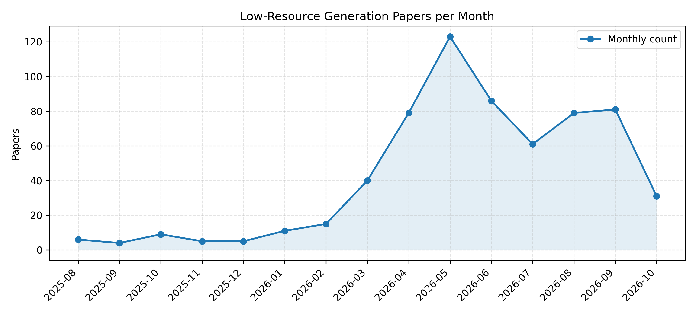

[![Contributors][contributors-shield]][contributors-url]
[![Forks][forks-shield]][forks-url]
[![Stargazers][stars-shield]][stars-url]
[![Issues][issues-shield]][issues-url]

# Low-Resource Generation Arxiv Daily Paper

This repository tracks low-resource generation related papers from arXiv.

## Updated on 2026.10.07

## Summary

- Total papers in JSON: **623**
- Recent 30 days: **83**
- Older than 30 days: **540**
- README display limit: **200** papers; extra papers stay in `docs/arxiv-daily.json`.

## Recent 30 Days

|Date|Title|Categories|PDF|Code|
|---|---|---|---|---|
|**2026-10-06**|**Language Unalignability: Why Some Concepts Resist Cross-Cultural Benchmark Evaluation**|cs.CL|[2610.08303v1](http://arxiv.org/abs/2610.08303v1)|null|
|**2026-10-06**|**VOMMI: Collecting and Leveraging Portable Demonstrations for Mobile Manipulation**|cs.RO, cs.AI|[2610.08220v1](http://arxiv.org/abs/2610.08220v1)|null|
|**2026-10-06**|**Improving Synthetic Data Generation for Argument Mining via Adversarial Reinforcement Learning**|cs.LG, cs.CL|[2610.07699v1](http://arxiv.org/abs/2610.07699v1)|null|
|**2026-10-05**|**HyperNSDE: Personalized Neural SDEs for Joint Static-Longitudinal Clinical Data Generation**|stat.ML, cs.LG, stat.AP, stat.ME|[2610.07383v1](http://arxiv.org/abs/2610.07383v1)|null|
|**2026-10-05**|**Xaurora: Generative Weather Forecasting with Denoising Stochastic Interpolants from a Foundation Model Prior**|cs.LG, physics.ao-ph|[2610.06509v1](http://arxiv.org/abs/2610.06509v1)|null|
|**2026-10-05**|**Constraint-Aware Conversational Job Recommendation in Code-Mixed Low-Resource Settings**|cs.IR|[2610.05787v1](http://arxiv.org/abs/2610.05787v1)|**[code](https://huggingface.co/datasets/Armans33115/JobCCC-Conversational-Job-Recommendation-Bangladesh)**|
|**2026-10-04**|**Investigating Model Compression for Neural Machine Translation in the Biomedical Domain**|cs.CL, cs.AI, cs.LG|[2610.07032v1](http://arxiv.org/abs/2610.07032v1)|null|
|**2026-10-04**|**Image Synthesis as an Intermediate for Controllable Time Series Generation**|cs.AI|[2610.05211v1](http://arxiv.org/abs/2610.05211v1)|null|
|**2026-10-03**|**Penumbra: Sample-Efficient Adversarial Search for Regulatory Obligations**|cs.AI, cs.CL, cs.CR|[2610.04693v1](http://arxiv.org/abs/2610.04693v1)|null|
|**2026-10-03**|**Agentic AI with Structured CoT for Enhancing AI's Spatial Intelligence: Visualization and Reasoning of Rotation**|cs.AI|[2610.04188v2](http://arxiv.org/abs/2610.04188v2)|null|
|**2026-10-02**|**Protecting Sensitive Data in Image Synthesis via PAC-Private Adaptation for Diffusion Models**|cs.LG|[2610.04038v1](http://arxiv.org/abs/2610.04038v1)|null|
|**2026-10-02**|**Multilingual GSM-Symbolic: What determines capability transfer across languages?**|cs.AI, cs.CL|[2610.03367v2](http://arxiv.org/abs/2610.03367v2)|null|
|**2026-10-02**|**Geometry Meets Physics: Data-Efficient Pre-Training for Unstructured Neural PDE Solvers**|cs.AI|[2610.03363v2](http://arxiv.org/abs/2610.03363v2)|null|
|**2026-10-02**|**Predicting Steering Vectors and Adapter Weights for Few-Shot Author-Style Transfer**|cs.CL, cs.AI|[2610.03163v1](http://arxiv.org/abs/2610.03163v1)|null|
|**2026-10-02**|**Enhancing Biomedical Named Entity Recognition via Multiple Programming Languages Instruction Tuning and Ensemble Method**|cs.CL|[2610.02949v1](http://arxiv.org/abs/2610.02949v1)|null|
|**2026-10-01**|**Fine-Grained Emotion Classification from Mobile App Reviews: An Empirical Study with Large Language Models**|cs.CL, cs.IR, cs.SE|[2610.03802v1](http://arxiv.org/abs/2610.03802v1)|null|
|**2026-10-01**|**How To Train Your World Model: Fine-tuning vs RAG for LM-based World Modeling**|cs.AI|[2610.02542v1](http://arxiv.org/abs/2610.02542v1)|null|
|**2026-10-01**|**Social bot detection in the age of ChatGPT: Challenges and opportunities**|cs.CY, cs.CL|[2610.02386v1](http://arxiv.org/abs/2610.02386v1)|null|
|**2026-10-01**|**Precision over Scale: A Polish-Silesian Benchmark and a Translation System Outperforming Open-Source and Commercial Models**|cs.CL|[2610.01082v2](http://arxiv.org/abs/2610.01082v2)|null|
|**2026-09-30**|**On-the-fly Weight Generation: A Hypernetwork Proof of Concept on ARC-1D**|cs.LG, cs.AI|[2610.00820v1](http://arxiv.org/abs/2610.00820v1)|null|
|**2026-09-30**|**LLM-as-a-Judge for Low-Resource Languages: Adapting Ragas and Comparative Ranking for Romanian**|cs.CL|[2610.00406v1](http://arxiv.org/abs/2610.00406v1)|null|
|**2026-09-30**|**MGhana-ST: A Low-Resource Speech Translation Dataset for Ghanaian Languages and an Analysis of Multilingual Training Trade-offs**|cs.CL|[2609.40041v2](http://arxiv.org/abs/2609.40041v2)|null|
|**2026-09-30**|**AIMS: An Agentic AI Framework for Sim-to-Real Multi-Modal ISAC**|cs.AI, cs.MA|[2609.39964v2](http://arxiv.org/abs/2609.39964v2)|null|
|**2026-09-30**|**Decoupled and Distilled: Task-Adaptive LoRA-Teachers with Ensemble Knowledge Transfer for Few-Shot Class-Incremental Learning**|cs.LG|[2609.39390v1](http://arxiv.org/abs/2609.39390v1)|null|
|**2026-09-30**|**Beyond Text: LLM-Based Dimensional Emotion Evaluation in Multimodal Dialogue**|cs.CL, cs.AI, cs.LG, cs.MM|[2609.39072v1](http://arxiv.org/abs/2609.39072v1)|null|
|**2026-09-30**|**StateTree: Enhancing Long-Term Dialogue Reasoning via Reinforcement Learning**|cs.CL, cs.AI|[2609.38809v1](http://arxiv.org/abs/2609.38809v1)|null|
|**2026-09-29**|**Towards Model as a Library: Offline, Community-Sourced AI for Low-Resource African Languages**|cs.AI, cs.CL, cs.HC|[2609.38574v1](http://arxiv.org/abs/2609.38574v1)|null|
|**2026-09-29**|**MatToolBench: Benchmarking Multimodal Agents in Real-World Materials Science Workflows**|cs.AI|[2609.37053v1](http://arxiv.org/abs/2609.37053v1)|null|
|**2026-09-29**|**Dating the Model: Hidden Dates in System Prompts Affect LLM Evaluation**|cs.CL|[2609.36931v1](http://arxiv.org/abs/2609.36931v1)|null|
|**2026-09-28**|**The Uneven Decline of Collective Knowledge Production: Evidence from Stack Overflow After Generative AI**|cs.SE, cs.AI, cs.DL|[2609.36069v1](http://arxiv.org/abs/2609.36069v1)|null|
|**2026-09-27**|**QuPID: Quantum Parameter-Efficient Input-Dependent Retrieval Adaptation for Medical RAG**|cs.AI, cs.LG|[2609.33351v1](http://arxiv.org/abs/2609.33351v1)|null|
|**2026-09-27**|**BaatCheet: A Multilingual Corpus for Dialogue Translation in Indian Languages**|cs.CL|[2609.33296v1](http://arxiv.org/abs/2609.33296v1)|null|
|**2026-09-27**|**Save Your Saturated Data: Learning Beyond Reward Saturation in Group-Based RL**|cs.LG, cs.CL|[2609.33126v1](http://arxiv.org/abs/2609.33126v1)|null|
|**2026-09-25**|**Evaluating Cultural Awareness of LLMs for Haitian Creole**|cs.CL, cs.AI|[2609.31506v1](http://arxiv.org/abs/2609.31506v1)|null|
|**2026-09-25**|**LUMO (Lightweight Unified Multilingual Orchestrator): A Privacy Preserving Offline Voice Assistant**|cs.LG|[2609.30692v1](http://arxiv.org/abs/2609.30692v1)|null|
|**2026-09-24**|**All In Good Time: Causality-Aware Framework for LLM-Based Simultaneous Speech-to-Speech Translation**|cs.CL|[2609.30416v1](http://arxiv.org/abs/2609.30416v1)|null|
|**2026-09-23**|**Beyond Poetry: Can Large Language Models Generate Classical Arabic Maqamat?**|cs.CL, cs.AI|[2609.28245v1](http://arxiv.org/abs/2609.28245v1)|null|
|**2026-09-22**|**TransBERT: A Framework for Synthetic Translation in Domain-Specific Language Modeling**|cs.CL, cs.AI, cs.LG|[2609.26347v2](http://arxiv.org/abs/2609.26347v2)|null|
|**2026-09-22**|**ARAFA: An LLM-Generated Arabic Fact-Checking Dataset**|cs.CL, cs.IR|[2609.25833v1](http://arxiv.org/abs/2609.25833v1)|null|
|**2026-09-21**|**URA-NER: A Unified Retrieval-Augmented Framework with Retrieval Alignment and Uncertainty Reduction for Low-Resource NER**|cs.CL, cs.AI|[2609.24372v1](http://arxiv.org/abs/2609.24372v1)|null|
|**2026-09-21**|**Few-Shot Demonstrations Elicit the Use of In-Context World Representations in LLMs**|cs.AI|[2609.24352v1](http://arxiv.org/abs/2609.24352v1)|null|
|**2026-09-20**|**Error-Supervised Synthetic Learner Writing for Automated Essay Scoring**|cs.CL|[2609.23573v1](http://arxiv.org/abs/2609.23573v1)|null|
|**2026-09-20**|**BabelArena: A Large-Scale Multilingual Benchmark for LLM Agents**|cs.CL|[2609.23490v1](http://arxiv.org/abs/2609.23490v1)|null|
|**2026-09-19**|**Beyond Similarity: Coverage-Aware Prompt Selection for Time Series Forecasting with LLMs**|cs.LG, cs.CL|[2609.22977v1](http://arxiv.org/abs/2609.22977v1)|null|
|**2026-09-18**|**Hybrid Machine Learning-Assisted Raman Spectroscopy with Generative Feature Augmentation for Pharmaceutical Identification**|cs.LG, cond-mat.mtrl-sci|[2610.02224v1](http://arxiv.org/abs/2610.02224v1)|null|
|**2026-09-18**|**Not All Irregularity Is Equal: Causally Isolating a Rare Failure Mode in Japanese Morphological Inflection**|cs.CL|[2609.21179v1](http://arxiv.org/abs/2609.21179v1)|null|
|**2026-09-17**|**Generative inversion for early ranking of competing geologic interpretations**|cs.LG|[2609.20978v1](http://arxiv.org/abs/2609.20978v1)|null|
|**2026-09-17**|**SpaceDiffusion: Over-the-Orbit Diffusion for Space Generate-and-Forward Communications**|cs.IT, cs.AI|[2609.20899v1](http://arxiv.org/abs/2609.20899v1)|null|
|**2026-09-17**|**AdaRepair-Mem: Adaptive Experience Orchestration for Repository-Level Program Repair**|cs.SE, cs.AI|[2609.20130v1](http://arxiv.org/abs/2609.20130v1)|null|
|**2026-09-17**|**CliniCIRCA: A Modular LLM Framework for Constructing Longitudinal Mental Health Patient Journeys from Raw EHR Narratives**|cs.CL, cs.AI, cs.IR, cs.LG|[2609.19585v1](http://arxiv.org/abs/2609.19585v1)|null|
|**2026-09-16**|**A Scalable Framework for Automated NER Annotation Correction in Low-Resource Languages**|cs.CL, cs.AI|[2609.18739v1](http://arxiv.org/abs/2609.18739v1)|null|
|**2026-09-16**|**Machine Translation between English and Syriac (East Syriac Dialect) using Statistical Machine Learning**|cs.CL|[2609.18529v1](http://arxiv.org/abs/2609.18529v1)|null|
|**2026-09-16**|**Reinforcement Learning for Real-Time Vision-Language-Action Policies**|cs.RO, cs.LG|[2609.18207v1](http://arxiv.org/abs/2609.18207v1)|**[code](https://pd-perry.github.io/real-time-expo-ft)**|
|**2026-09-16**|**A Comprehensive Review of Generative Physical Artificial Intelligence**|cs.RO, cs.AI, cs.CL, cs.CV, cs.LG|[2609.18111v1](http://arxiv.org/abs/2609.18111v1)|null|
|**2026-09-16**|**When to Call an LLM: A Confidence-Gated Hybrid for Cost-Effective Emotion Recognition in Conversational AI**|cs.AI|[2609.17977v1](http://arxiv.org/abs/2609.17977v1)|null|
|**2026-09-15**|**Robust and Efficient AI Frameworks for Scalable Material Design and Property Prediction**|cond-mat.mtrl-sci, cs.LG|[2609.17646v1](http://arxiv.org/abs/2609.17646v1)|null|
|**2026-09-15**|**Towards Detecting AI-Assisted Responses in Online Surveys**|cs.CL, cs.CY|[2609.17317v1](http://arxiv.org/abs/2609.17317v1)|**[code](https://github.com/mike-qz-wang/ASURRE)**|
|**2026-09-15**|**MyoFlow: Anchor-Tied Rectified Flow for HD-sEMG Gesture Recognition Across Sessions and Subjects**|cs.LG|[2609.17194v2](http://arxiv.org/abs/2609.17194v2)|null|
|**2026-09-14**|**A Language-Guided Multimodal Foundation Model for Zero-Shot and Multi-Task Brain Signal Analysis**|cs.LG, cs.AI|[2609.15740v1](http://arxiv.org/abs/2609.15740v1)|null|
|**2026-09-14**|**Authorship attribution and aesthetic evaluation of AI poetry: a case study with Haiku**|cs.CL, cs.AI|[2609.15511v1](http://arxiv.org/abs/2609.15511v1)|null|
|**2026-09-14**|**ProtoGuide: Prototype-Driven Guidance for Class-Conditional Graph Generation**|cs.LG, cs.AI, physics.soc-ph|[2609.15239v1](http://arxiv.org/abs/2609.15239v1)|null|
|**2026-09-13**|**TriCalRAG: A Three-Strategy, Retrieval-Augmented Benchmark for On-Premise LLM-Based Root Cause Analysis in AIOps**|cs.DC, cs.AI, cs.CR, cs.ET, cs.LG|[2609.14762v1](http://arxiv.org/abs/2609.14762v1)|null|
|**2026-09-13**|**Corpus Characterization and Inverse Constitutional Fine-Tuning for Style-Aware Radiology Reports**|cs.CL|[2609.14226v1](http://arxiv.org/abs/2609.14226v1)|null|
|**2026-09-12**|**Conditional Quantum Flow Matching for Data-Scarce Physiological Signal Augmentation**|quant-ph, cs.LG, cs.MM|[2609.14019v1](http://arxiv.org/abs/2609.14019v1)|null|
|**2026-09-12**|**Scaling Hindi Quantum Natural Language Processing through Automatic Pregroup Supertagging**|cs.CL, quant-ph|[2609.13721v1](http://arxiv.org/abs/2609.13721v1)|null|
|**2026-09-12**|**The University of Melbourne WMT 2026 CreoleMT Submission: A Domain-Balanced Approach to Low-Resource Pacific Creole Machine Translation**|cs.CL|[2609.13615v1](http://arxiv.org/abs/2609.13615v1)|null|
|**2026-09-11**|**Breaking the Token Ceiling: Distilling Smaller, Stronger Byte Models**|cs.CL, cs.AI, cs.LG|[2609.12303v1](http://arxiv.org/abs/2609.12303v1)|null|
|**2026-09-10**|**Beyond Word Error Rate: A Switch Aware Evaluation of ASR and Audio Language Models on English Yoruba Code-Switched Speech**|cs.CL, cs.AI|[2609.11786v1](http://arxiv.org/abs/2609.11786v1)|null|
|**2026-09-10**|**Complex-Text Robustness Evaluation and Failure Diagnosis for Low-Resource Multilingual Text-to-Speech**|cs.CL, cs.SD|[2609.11545v1](http://arxiv.org/abs/2609.11545v1)|null|
|**2026-09-09**|**Multilingual in Name Only? Cultural and Linguistic Weaknesses of LLMs in Urdu**|cs.CL, cs.AI, cs.LG|[2609.10758v1](http://arxiv.org/abs/2609.10758v1)|null|
|**2026-09-09**|**Data-Efficient Language Modeling: From Frontier Advancement to Principle-Guided Model Improvement**|cs.CL, cs.AI|[2609.10702v1](http://arxiv.org/abs/2609.10702v1)|null|
|**2026-09-09**|**5-Dialects-BN: Unmasking the Impact of Transliteration on Bangla Dialectal LLMs**|cs.CL|[2609.09964v1](http://arxiv.org/abs/2609.09964v1)|null|
|**2026-09-09**|**Improving Cross-Lingual Token Representations by Adding a Pinch of SALT**|cs.CL, cs.AI|[2609.09953v1](http://arxiv.org/abs/2609.09953v1)|null|
|**2026-09-09**|**Leveraging Fine-grained Error Correction in Korean Speech Recognition for Consultation Services**|cs.CL|[2609.09889v1](http://arxiv.org/abs/2609.09889v1)|null|
|**2026-09-09**|**Exact Degeneracy Under Balanced k-Shot Sampling:Consequences for Small-Sample Discriminant Analysis on LLM Embeddings**|cs.LG|[2609.09860v1](http://arxiv.org/abs/2609.09860v1)|null|
|**2026-09-09**|**SEA-SpeechBench: A Large-Scale Multitask Benchmark for Speech Understanding Across Southeast Asia**|cs.CL|[2609.09672v1](http://arxiv.org/abs/2609.09672v1)|**[code](https://zwenyu.github.io/SEA-SpeechBench/)**|
|**2026-09-08**|**Do LLMs Make More Mistakes If They Do Not Believe the Input Data?**|cs.CL|[2609.09363v1](http://arxiv.org/abs/2609.09363v1)|null|
|**2026-09-08**|**RoboCousin: Build Your Own Simulation Playground for Robust Bimanual Robotic Manipulation**|cs.RO, cs.AI|[2609.08339v1](http://arxiv.org/abs/2609.08339v1)|null|
|**2026-09-08**|**LEBGen: An LLM-Enhanced Bayesian Network Framework for Few-Shot Travel Survey Data Generation**|cs.AI|[2609.08288v1](http://arxiv.org/abs/2609.08288v1)|null|
|**2026-09-07**|**BanglaMemeX: Advancing Cultural Metaphoric Image Interpretation in Bangla with a Multimodal Explainable Dataset**|cs.CL, cs.CV|[2609.08029v1](http://arxiv.org/abs/2609.08029v1)|null|
|**2026-09-07**|**Measuring Language Transfer in Robot Policies: Adding Greek to a Cosmos3 Vision-Language-Action Policy**|cs.RO, cs.AI|[2609.07470v1](http://arxiv.org/abs/2609.07470v1)|null|
|**2026-09-07**|**AAS-RAIL: Improving Information Extraction for Asset Administration Shells through Retrieval-Augmented In-Context Learning**|cs.AI|[2609.07334v1](http://arxiv.org/abs/2609.07334v1)|null|
|**2026-09-07**|**AI and TCAD for Inverse Design and Defect Discovery: From Simple Machine Learning to LLM**|cs.LG|[2609.07046v1](http://arxiv.org/abs/2609.07046v1)|null|

## Older Than 30 Days

|Date|Title|Categories|PDF|Code|
|---|---|---|---|---|
|**2026-09-05**|**SLATE: Are AI-Generated Slides Educationally Effective? A Benchmark for Language Teaching Quality and Learner Knowledge Acquisition**|cs.CL|[2609.06212v1](http://arxiv.org/abs/2609.06212v1)|null|
|**2026-09-04**|**Distill Globally, Adapt Locally: Reasoning Distillation and Product-Type Test-Time Training for Scalable Trade-Up Recommendation**|cs.LG|[2609.05363v1](http://arxiv.org/abs/2609.05363v1)|null|
|**2026-09-04**|**MedFlow: Class-Aware Multi-Scale Generation for Medical Time-Series Synthesis**|cs.AI|[2609.04804v1](http://arxiv.org/abs/2609.04804v1)|null|
|**2026-09-04**|**Choosing the Right Language Mode at Inference Time for Multilingual Reliability**|cs.CL|[2609.04653v1](http://arxiv.org/abs/2609.04653v1)|null|
|**2026-09-04**|**When Do Internal Probes Beat Reading the Answer? Miscalibrated Readouts and Behavior-Concealed Knowledge in Language Models**|cs.CL, cs.AI|[2609.04582v1](http://arxiv.org/abs/2609.04582v1)|null|
|**2026-09-03**|**Dynamic Adaptation of the LLM Context for Generating Routines with Coupled Semantics**|cs.SE, cs.AI|[2609.04570v1](http://arxiv.org/abs/2609.04570v1)|null|
|**2026-09-03**|**Translation as a Decision Space: A Multi-Agent Perspective on Low-Resource Dialect Generation**|cs.CL, cs.AI|[2609.04048v1](http://arxiv.org/abs/2609.04048v1)|null|
|**2026-09-03**|**Beyond BLEU: A Case for Redefining Sign Language Translation Benchmarks**|cs.CL, cs.AI|[2609.03734v1](http://arxiv.org/abs/2609.03734v1)|null|
|**2026-09-03**|**Building and Evaluating Fixed-Voice Thai TTS from Synthetic Speech**|cs.CL, cs.AI|[2609.03502v1](http://arxiv.org/abs/2609.03502v1)|null|
|**2026-09-02**|**Improving Health Literacy through Lay Summarization of Radiological Reports: An Evaluation of BioNER and Retrieval-Augmented Generation**|cs.CL|[2609.02396v1](http://arxiv.org/abs/2609.02396v1)|null|
|**2026-09-02**|**PolERo: Studying Political Evasion in Romanian**|cs.CL, cs.AI|[2609.02391v1](http://arxiv.org/abs/2609.02391v1)|null|
|**2026-09-02**|**Prototype-guided transfer of sparse literature knowledge for electrolyte additive discovery**|physics.chem-ph, cs.LG|[2609.02209v1](http://arxiv.org/abs/2609.02209v1)|null|
|**2026-09-01**|**Automated Event Log Generation from Unstructured Text Using Finetuned LLMs**|cs.AI|[2609.01320v1](http://arxiv.org/abs/2609.01320v1)|null|
|**2026-09-01**|**Measuring the Behavioral Fidelity of Long-Horizon Human Activity Simulations**|cs.AI|[2609.01257v1](http://arxiv.org/abs/2609.01257v1)|null|
|**2026-09-01**|**Text-guided flow matching enables sample-efficient crystal structure generation**|cond-mat.mtrl-sci, cs.AI|[2609.01076v2](http://arxiv.org/abs/2609.01076v2)|null|
|**2026-09-01**|**Inspicio: Open-Vocabulary, LLM-Based Sense Retrieval for Historical Languages**|cs.CL, cs.AI|[2609.00998v1](http://arxiv.org/abs/2609.00998v1)|null|
|**2026-09-01**|**Automated Tree Knowledge Graph Construction using Ontology Expansion and Retrieval from Vietnamese History Textbooks**|cs.AI|[2609.00763v1](http://arxiv.org/abs/2609.00763v1)|null|
|**2026-08-31**|**Enhancing Low-Resource Language Reasoning via High-Resource Language Feature Transfer**|cs.CL, cs.AI|[2608.30462v1](http://arxiv.org/abs/2608.30462v1)|null|
|**2026-08-31**|**Generative multi-domain transfer learning for fault detection in data-scarce wind turbines**|cs.LG|[2608.30323v1](http://arxiv.org/abs/2608.30323v1)|null|
|**2026-08-30**|**Confident but Wrong: A Constrained Decoding Diagnostic for Low-Resource Automatic Post-Editing**|cs.CL|[2609.29680v1](http://arxiv.org/abs/2609.29680v1)|null|
|**2026-08-30**|**Pak3H: Evaluating the Cost of Cultural Mismatch in LLM Alignment with a Human-Contextualized Urdu Benchmark**|cs.CL, cs.AI|[2608.30065v1](http://arxiv.org/abs/2608.30065v1)|null|
|**2026-08-30**|**Generative vs. Encoder Models for Multilingual NER: A Comprehensive Empirical Study on Naamapadam**|cs.CL|[2608.29959v1](http://arxiv.org/abs/2608.29959v1)|null|
|**2026-08-30**|**Improving Argument Saliency Coverage in Small LLMs for Long Legal Opinion Summarization via Sequence-Level Distillation**|cs.CL|[2608.29884v1](http://arxiv.org/abs/2608.29884v1)|null|
|**2026-08-30**|**GraM-Diff: A Unified Graph-Mamba Diffusion Framework for EEG-Based Alzheimer's Disease Data Generation and Diagnosis**|cs.LG|[2608.29755v1](http://arxiv.org/abs/2608.29755v1)|null|
|**2026-08-29**|**BIRD-History: A Benchmark for History-Driven Text-to-SQL with Fine-Grained Knowledge Annotations**|cs.AI, cs.CL|[2608.29345v1](http://arxiv.org/abs/2608.29345v1)|**[code](https://github.com/zjuidg/BIRD-History)**|
|**2026-08-29**|**Padārtha: Ontology-Grounded Fine-Grained NER Benchmark for Classical Sanskrit**|cs.CL|[2608.29324v1](http://arxiv.org/abs/2608.29324v1)|null|
|**2026-08-29**|**Anchoring Speech with Semantics: A Multimodal Adapter Mechanism for Automatic Speech Recognition in Low-Resource Languages**|cs.CL, cs.SD, eess.AS|[2608.29239v1](http://arxiv.org/abs/2608.29239v1)|null|
|**2026-08-29**|**Toward a Cross-Lingual Romanization Ecosystem for Sinitic Languages: A Paired Mandarin-Cantonese Case Study**|cs.CL|[2608.29170v2](http://arxiv.org/abs/2608.29170v2)|null|
|**2026-08-28**|**NL2AGBench: Benchmarking LLM Auto-Formalization for AlphaGeometry**|cs.CL, cs.AI|[2608.28481v1](http://arxiv.org/abs/2608.28481v1)|null|
|**2026-08-28**|**CNeo-Bench: Diagnosing Large Language Models on Chinese Neologisms**|cs.CL|[2608.28053v1](http://arxiv.org/abs/2608.28053v1)|null|
|**2026-08-27**|**pro-team at LLMs4OL 2026 Tasks Flagship and Reuse: Retrieval-Augmented Generation and Vocabulary-Constrained Filtering for Ontology Learning**|cs.AI|[2608.27101v2](http://arxiv.org/abs/2608.27101v2)|null|
|**2026-08-26**|**Benchmarking Arabic--Russian Machine Translation: A Comparison of Fine-tuned NMT and Few-shot LLMs under Rich Morphology and Low Lexical Overlap**|cs.CL|[2609.29559v1](http://arxiv.org/abs/2609.29559v1)|null|
|**2026-08-26**|**Cross-lingual Representation Learning via Centroid Intervention Fusion**|cs.CL|[2608.26357v1](http://arxiv.org/abs/2608.26357v1)|**[code](https://github.com/VRCMF/CIF.git)**|
|**2026-08-26**|**PhaseShift: Topology-Aware Data Harmonization and Model Consolidation Across Signalized Intersections**|cs.AI, cs.RO|[2608.25275v1](http://arxiv.org/abs/2608.25275v1)|null|
|**2026-08-25**|**Padamitra: Grounded Glossary Generation for Classical Sanskrit**|cs.CL|[2608.25038v2](http://arxiv.org/abs/2608.25038v2)|null|
|**2026-08-25**|**Do Recipes Have Personas? Characterizing and Generating Creator Style in Attributed Procedural Graphs**|cs.AI|[2608.24369v1](http://arxiv.org/abs/2608.24369v1)|null|
|**2026-08-25**|**PhysicsBench: A Unified Leaderboard for Generative and Predictive Models in Engineering Design and Simulation**|cs.LG, cs.CE|[2608.24056v1](http://arxiv.org/abs/2608.24056v1)|null|
|**2026-08-24**|**StrategyBench: Evaluating Explicit Strategy Induction in Large Language Models**|cs.AI|[2608.23475v1](http://arxiv.org/abs/2608.23475v1)|**[code](https://anonymous.4open.science/r/StrategyBench-D53C)**|
|**2026-08-24**|**MetaCaster: Meta-Harness-Optimized Agent for End-to-End Few-Shot Learning of Lightweight Time Series Forecasters**|cs.LG, cs.AI|[2608.23473v2](http://arxiv.org/abs/2608.23473v2)|null|
|**2026-08-24**|**The Geometry of Low-Resource Language Representations**|cs.CL|[2608.23358v1](http://arxiv.org/abs/2608.23358v1)|null|
|**2026-08-24**|**From Multimodal Observation to Interpretable Suggestions: Counterfactual Time-Expanded Relational Modeling of Surgical Teams**|cs.LG|[2608.23254v1](http://arxiv.org/abs/2608.23254v1)|null|
|**2026-08-24**|**Statistical Machine Translation Systems of English-Pnar Language Pair : Some Insights of the Emperical Study**|cs.CL, cs.AI|[2608.23120v1](http://arxiv.org/abs/2608.23120v1)|null|
|**2026-08-24**|**DIAG: Diagnostic Iterative Alignment and Generation for Data-Efficient Mathematical Preference Distillation**|cs.CL|[2608.22806v1](http://arxiv.org/abs/2608.22806v1)|null|
|**2026-08-22**|**LLMs are Few-Shot Decision-Makers: Generalized Context-Aware Microgrid Frequency Control through Prompt Decision Transformer**|eess.SY, cs.AI|[2608.21858v1](http://arxiv.org/abs/2608.21858v1)|null|
|**2026-08-20**|**HealMed: Multilingual Evaluation of Large Language Models in Medicine**|cs.CL|[2608.19981v1](http://arxiv.org/abs/2608.19981v1)|null|
|**2026-08-20**|**ADAPT: Physics-Aware Diffusion-based World Models for Adaptive Predictive Transferable HVAC Control**|cs.AI|[2608.19804v1](http://arxiv.org/abs/2608.19804v1)|null|
|**2026-08-19**|**TranslatePsy-AfriSLM: High-Quality Data Scaling For Low-Resource Machine Translation**|cs.CL|[2608.18655v2](http://arxiv.org/abs/2608.18655v2)|null|
|**2026-08-19**|**FACET: Preserving Source Intent and Executable State in Terminal Task Synthesis**|cs.AI, cs.PL|[2608.18580v1](http://arxiv.org/abs/2608.18580v1)|null|
|**2026-08-18**|**Analysis of Types of Inquiries in Student-AI Interaction: A case study of two CS2 tasks**|cs.HC, cs.AI|[2608.17919v1](http://arxiv.org/abs/2608.17919v1)|null|
|**2026-08-18**|**GADR: Gathering Architecture Decision Records from Meeting Transcriptions**|cs.SE, cs.AI|[2608.17694v1](http://arxiv.org/abs/2608.17694v1)|null|
|**2026-08-18**|**Cognitive Graph Intelligence for Adaptive and Robust DDoS Attack Detection in Next Generation Networks**|cs.AI|[2608.17352v1](http://arxiv.org/abs/2608.17352v1)|null|
|**2026-08-17**|**Beyond Asking: A Pipeline for Personalized Game Generation that Reads Players from Behavior**|cs.AI, cs.HC|[2608.16196v1](http://arxiv.org/abs/2608.16196v1)|null|
|**2026-08-16**|**Iterative Self-Learning for Expressive Text-to-Speech Synthesis**|eess.AS, cs.CL, cs.SD|[2608.15910v1](http://arxiv.org/abs/2608.15910v1)|null|
|**2026-08-16**|**When Less Is Enough: Context Selection and Prompting Strategies for Bengali News Headline Generation**|cs.CL|[2608.15879v1](http://arxiv.org/abs/2608.15879v1)|null|
|**2026-08-16**|**BengaliMCQ: Automatic Generation and Answer Prediction of Academic Multiple-Choice Questions in a Low-Resource Language**|cs.CL|[2608.15547v1](http://arxiv.org/abs/2608.15547v1)|null|
|**2026-08-15**|**Agentic-SQL Revisited: Autonomy-Based Taxonomy and Empirical Benchmark Analysis for LLM Text-to-SQL**|cs.AI|[2608.15389v2](http://arxiv.org/abs/2608.15389v2)|null|
|**2026-08-15**|**Structuring Semantic Embeddings for Principle Evaluation: A Prototype-Guided Contrastive Learning Approach**|cs.LG|[2608.15224v2](http://arxiv.org/abs/2608.15224v2)|null|
|**2026-08-14**|**Envs-FORGE: Frontier-Optimized Reward-Grounded Environment Synthesis for Agent RL**|cs.CL|[2608.14312v1](http://arxiv.org/abs/2608.14312v1)|**[code](https://github.com/DataArcTech/DataArc-SynData-Toolkit/)**|
|**2026-08-13**|**BM25-Augmented Many-Shot Translation for Low-Resource North-Eastern Indian Languages**|cs.CL|[2608.13722v1](http://arxiv.org/abs/2608.13722v1)|null|
|**2026-08-13**|**TeachMateGPT: A Multi-Agent Knowledge-Grounded Framework for Pedagogical Assessment Generation from Science Curriculum Materials**|cs.CL, cs.AI|[2608.13708v1](http://arxiv.org/abs/2608.13708v1)|null|
|**2026-08-13**|**HybridRAG-BN: A Retrieval-Augmented Framework with Fine-Tuned Verification for Bangla KBQA**|cs.CL, cs.IR|[2608.13004v1](http://arxiv.org/abs/2608.13004v1)|null|
|**2026-08-13**|**Query Translation vs. Cross-Lingual Embeddings for Sinhala-Tamil E-Government Information Retrieval**|cs.IR|[2608.12820v1](http://arxiv.org/abs/2608.12820v1)|null|
|**2026-08-12**|**Preference Tree Optimization: Enhancing Goal-Oriented Dialogue with Look-Ahead Simulations**|cs.CL, cs.AI|[2608.12062v2](http://arxiv.org/abs/2608.12062v2)|null|
|**2026-08-12**|**Poly-Dialectal Neural Machine Translation System for Bangla Regional Dialects**|cs.CL|[2608.12018v1](http://arxiv.org/abs/2608.12018v1)|**[code](https://data.mendeley.com/datasets/v9cf66fk2t/2)**|
|**2026-08-12**|**When the Knowledge Base Becomes the Gold Standard: Measuring Resource-Shared Evaluation Loops in Entity-Level Machine Translation**|cs.CL, cs.DL|[2608.11843v1](http://arxiv.org/abs/2608.11843v1)|null|
|**2026-08-11**|**Reward-Oracle MCTS for Formal Theorem Proving: Sample-Efficient Search and the Need for Kernel-Level Proof Auditing**|cs.AI, cs.LG, cs.LO|[2608.28639v1](http://arxiv.org/abs/2608.28639v1)|null|
|**2026-08-11**|**The Illusion of Cross-Lingual Safety in Low-Resource Languages**|cs.CL|[2608.11146v1](http://arxiv.org/abs/2608.11146v1)|null|
|**2026-08-11**|**Physics-informed Diffusion Generative Model for Time-Series Data Synthesis in Dynamic Systems**|cs.LG|[2608.10941v1](http://arxiv.org/abs/2608.10941v1)|null|
|**2026-08-11**|**A Cost-Efficient Routing Pipeline for Multilingual Short-Text Classification Using Small Language Models**|cs.CL, cs.AI|[2608.10939v1](http://arxiv.org/abs/2608.10939v1)|null|
|**2026-08-09**|**Integrated Multimodal AI System for Retrieval-Augmented Reasoning, Object Sensing, and Damage Analysis**|cs.AI|[2608.08935v1](http://arxiv.org/abs/2608.08935v1)|null|
|**2026-08-09**|**Curriculum Generation under Structured Parametric Environments for Robust Navigation Policies**|cs.RO, cs.LG|[2608.08545v1](http://arxiv.org/abs/2608.08545v1)|null|
|**2026-08-08**|**A Hierarchical Energy-Based Model for Multimodal Cognition**|q-bio.NC, cs.AI|[2608.12398v1](http://arxiv.org/abs/2608.12398v1)|null|
|**2026-08-08**|**DialectS2S: End-to-End Speech Dialogue Modeling for Low-Resource Chinese Dialects**|cs.CL, cs.AI|[2608.08067v2](http://arxiv.org/abs/2608.08067v2)|null|
|**2026-08-07**|**Embedding Initialization for Unseen Low-resource Languages in Multilingual NMT: A Case Study on Limbum-English Translation**|cs.CL, cs.LG|[2608.07629v1](http://arxiv.org/abs/2608.07629v1)|null|
|**2026-08-07**|**Skaling: Chinchilla's Exponents Meet Kaplan's Coupling**|cs.CL|[2608.07222v1](http://arxiv.org/abs/2608.07222v1)|null|
|**2026-08-07**|**Decoupling Intention from Trajectory: A Representational Deduction Framework for World Action Models**|cs.RO, cs.AI|[2608.06994v1](http://arxiv.org/abs/2608.06994v1)|null|
|**2026-08-07**|**Evolving Parallel Algorithm Portfolios via Potential-Aware Instance Generation with LLMs**|cs.AI|[2608.06808v1](http://arxiv.org/abs/2608.06808v1)|null|
|**2026-08-07**|**Multi-Perspective Triad Interaction Graph Neural Network for Cognitive Distortion Detection**|cs.CL|[2608.06785v1](http://arxiv.org/abs/2608.06785v1)|null|
|**2026-08-06**|**SAGA: Score-Weighted Adaptive Generation Alignment for Low-Resource Nordic Language Models**|cs.LG|[2608.06179v2](http://arxiv.org/abs/2608.06179v2)|null|
|**2026-08-06**|**Clinical Communication Processing with Models Trained on LLM-Generated Synthetic Data: A Structured Survey and Novel Application Case Studies**|cs.CL|[2608.05993v1](http://arxiv.org/abs/2608.05993v1)|null|
|**2026-08-06**|**MameLoshnLM: Yiddish Language Model and Evaluation Benchmark**|cs.CL, cs.AI|[2608.05850v1](http://arxiv.org/abs/2608.05850v1)|null|
|**2026-08-05**|**Traceable LLM-Generated Hazard Scenarios for Operational Safety Analysis of Aviation Systems Using ASRS Reports**|cs.AI|[2608.04697v1](http://arxiv.org/abs/2608.04697v1)|null|
|**2026-08-05**|**Breaking the Curse of Multilinguality in Many-to-Many Speech-to-Text Translation via a Resource-Aware Mixture of Speech Encoders**|cs.CL, cs.AI|[2608.04586v2](http://arxiv.org/abs/2608.04586v2)|null|
|**2026-08-04**|**The RAIL Principles for Neurosymbolic AI: Reasoning, Assurances, Interfacing and Learning**|cs.AI, cs.LG|[2608.04285v1](http://arxiv.org/abs/2608.04285v1)|null|
|**2026-08-04**|**Large Language Models for Low-Resource Languages: A Conceptual Framework for an Electronic Explanatory Dictionary of the Tajik Language**|cs.CL|[2608.04186v2](http://arxiv.org/abs/2608.04186v2)|null|
|**2026-08-04**|**Assessment of Conditional Diffusion Model for Synthetic Histopathology Image Generation**|cs.LG|[2608.03990v1](http://arxiv.org/abs/2608.03990v1)|null|
|**2026-08-04**|**M-GATE: Multilingual Grammar, Accuracy in Translation, and Efficiency Benchmark for Large Language Models**|cs.CL, cs.LG|[2608.03803v1](http://arxiv.org/abs/2608.03803v1)|**[code](https://m-gate.ai)**|
|**2026-08-04**|**DiagLoop: A Counterfactual Data Flywheel with Stage-Localized Reinforcement for Diagnostic LLMs**|cs.LG|[2608.03674v1](http://arxiv.org/abs/2608.03674v1)|null|
|**2026-08-04**|**Looking under the Wrong Lamppost: On the Limitations of Automated Translation Quality Estimation**|cs.CL|[2608.03577v1](http://arxiv.org/abs/2608.03577v1)|null|
|**2026-08-04**|**ConlangBench: Exploring Language Knowledge and Learning in LLMs through Diverse Constructed Languages**|cs.CL|[2608.03505v2](http://arxiv.org/abs/2608.03505v2)|null|
|**2026-08-04**|**VIVID: A Culturally Grounded Benchmark Exposing the Figurative Language Gap in Vietnamese NLP**|cs.CL, cs.LG|[2608.03095v1](http://arxiv.org/abs/2608.03095v1)|null|
|**2026-08-03**|**FLARE: Few-shot Learning-based Adaptive Reflective Engine**|cs.CL|[2608.02919v1](http://arxiv.org/abs/2608.02919v1)|null|
|**2026-08-03**|**LAB-Tab: LLM-Augmented Bayesian Network Adaptation for Few-Shot Tabular Generation**|cs.LG, cs.AI|[2608.01879v1](http://arxiv.org/abs/2608.01879v1)|null|
|**2026-08-02**|**ArabicDialectSafety: A Dialect-Aware Benchmark for Arabic Content Safety Classification**|cs.CL|[2608.01291v2](http://arxiv.org/abs/2608.01291v2)|null|
|**2026-08-02**|**Opt.Gear Technical Report**|cs.CL|[2608.01034v2](http://arxiv.org/abs/2608.01034v2)|null|
|**2026-08-01**|**Native Multilingual Chain-of-Thought Reasoning in Low-Resource Southeast Asian Languages**|cs.CL, cs.AI, cs.LG|[2608.00533v1](http://arxiv.org/abs/2608.00533v1)|null|
|**2026-07-31**|**Bridging the English-Arabic Medical Knowledge Gap: Targeted Low-Rank Adaptation via Causal Layer Selection**|cs.CL|[2608.00207v1](http://arxiv.org/abs/2608.00207v1)|null|
|**2026-07-31**|**Cross-Lingual Transfer for Machine Translation in Turkic Languages**|cs.CL, cs.AI|[2607.29355v1](http://arxiv.org/abs/2607.29355v1)|null|
|**2026-07-30**|**Using Large Language Models for Idea Generation in Innovation**|cs.AI, cs.CL, econ.GN|[2607.27553v1](http://arxiv.org/abs/2607.27553v1)|null|
|**2026-07-29**|**Equilibrium Training of Energy-Based Models with Parallel Trajectory Tempering**|cs.LG, cond-mat.dis-nn, cond-mat.stat-mech|[2607.27077v2](http://arxiv.org/abs/2607.27077v2)|null|
|**2026-07-29**|**From Passive Video to Editable Experience: Physically Grounded Experience Synthesis for Embodied Intelligence**|cs.AI, cs.RO|[2607.26903v1](http://arxiv.org/abs/2607.26903v1)|null|
|**2026-07-28**|**Evaluating Prompt Scope and Demonstration Similarity in Local LLM Machine Translation**|cs.CL|[2607.26286v1](http://arxiv.org/abs/2607.26286v1)|null|
|**2026-07-28**|**A Control System, a Dataset, and a Recipe for Making Frozen LLM Agents Learn a Domain**|cs.AI|[2607.25415v1](http://arxiv.org/abs/2607.25415v1)|null|
|**2026-07-27**|**Systematic Analysis of Large Language Models and Transformer-Based Machine Translation for English-Tamil and Tamil-English Across Diverse Datasets**|cs.CL|[2607.24515v2](http://arxiv.org/abs/2607.24515v2)|null|
|**2026-07-26**|**Guiding Language Models to Be More Empathetic: Culturally Sensitive Mental Health Advice Generation Through Human-LLM Collaboration**|cs.CL|[2607.23538v1](http://arxiv.org/abs/2607.23538v1)|null|
|**2026-07-26**|**NeurGO: Learning to Generate Elite Candidates for Meta-Black-Box Expensive Optimization**|cs.AI|[2607.23408v1](http://arxiv.org/abs/2607.23408v1)|null|
|**2026-07-24**|**Complexity Bounds and Approaches to Learning Projected Gradient Descent Solver Iterates**|cs.LG|[2607.22467v1](http://arxiv.org/abs/2607.22467v1)|null|
|**2026-07-24**|**A Factorial Study of Synthetic Data Generation for Low-Resource Machine Translation using Grammar Books**|cs.CL|[2607.22376v1](http://arxiv.org/abs/2607.22376v1)|null|
|**2026-07-24**|**Towards Trustworthy and Cost-Efficient Data Integration: From Naïve RAG to Agentic RAG**|cs.DB, cs.AI|[2607.22319v1](http://arxiv.org/abs/2607.22319v1)|null|
|**2026-07-24**|**Biomedical Machine Translation for Low-Resource Arabic-Script Languages via Cross-Lingual Transfer and LoRA Adapter Merging**|cs.CL|[2607.22300v1](http://arxiv.org/abs/2607.22300v1)|null|
|**2026-07-24**|**One Hand Watches The Other: Dynamic Multi-Agent Cooperation for Sample-Efficient Bimanual Manipulation in Dynamic Environments**|cs.RO, cs.AI, cs.LG|[2607.22119v1](http://arxiv.org/abs/2607.22119v1)|null|
|**2026-07-24**|**MEUSLI: a Multilingual Projector for LLM-based ASR and Beyond**|cs.CL, cs.AI, eess.AS|[2607.22100v1](http://arxiv.org/abs/2607.22100v1)|null|
|**2026-07-23**|**Expert Behavior Prior Reinforcement Learning**|cs.AI|[2607.21302v2](http://arxiv.org/abs/2607.21302v2)|null|
|**2026-07-22**|**The Maskability Index: Predicting Task-Objective Alignment in Pretrained Language Models**|cs.CL, cs.AI|[2607.20265v1](http://arxiv.org/abs/2607.20265v1)|null|
|**2026-07-22**|**When Does Knowledge Distillation Hurt? Reliability-Aware Distillation for Low-Resource Language Summarization**|cs.CL, cs.AI|[2607.19956v1](http://arxiv.org/abs/2607.19956v1)|null|
|**2026-07-21**|**SynPre-FL: Synthetic data-driven pretraining integrated Federated Learning training framework**|cs.LG, cs.AI, cs.DC|[2607.19524v1](http://arxiv.org/abs/2607.19524v1)|null|
|**2026-07-21**|**Translation as Augmentation: Effect of Translated Data on Assessment of Difficulty**|cs.CL, cs.LG|[2607.19101v1](http://arxiv.org/abs/2607.19101v1)|null|

README omitted **423** older paper(s). See `docs/arxiv-daily.json` for the full archive.

[contributors-shield]: https://img.shields.io/github/contributors/bansky-cl/low-resource-generation-arxiv-daily-paper.svg?style=for-the-badge
[contributors-url]: https://github.com/bansky-cl/low-resource-generation-arxiv-daily-paper/graphs/contributors
[forks-shield]: https://img.shields.io/github/forks/bansky-cl/low-resource-generation-arxiv-daily-paper.svg?style=for-the-badge
[forks-url]: https://github.com/bansky-cl/low-resource-generation-arxiv-daily-paper/network/members
[stars-shield]: https://img.shields.io/github/stars/bansky-cl/low-resource-generation-arxiv-daily-paper.svg?style=for-the-badge
[stars-url]: https://github.com/bansky-cl/low-resource-generation-arxiv-daily-paper/stargazers
[issues-shield]: https://img.shields.io/github/issues/bansky-cl/low-resource-generation-arxiv-daily-paper.svg?style=for-the-badge
[issues-url]: https://github.com/bansky-cl/low-resource-generation-arxiv-daily-paper/issues
